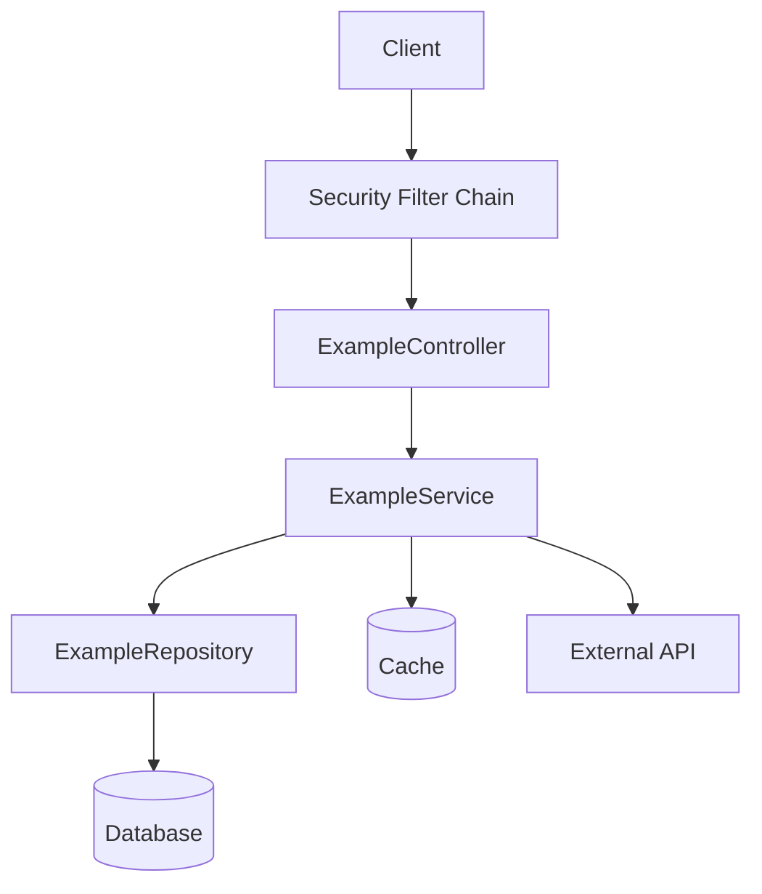
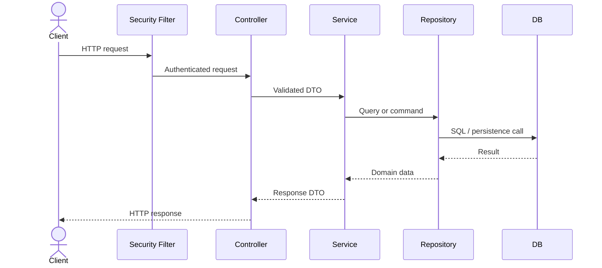
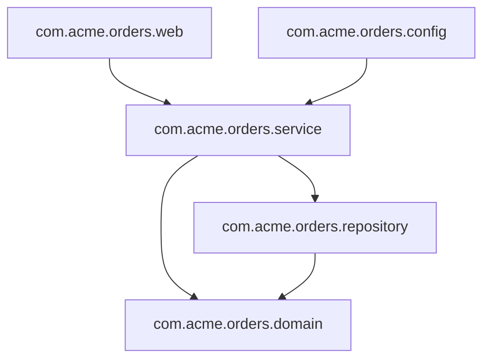
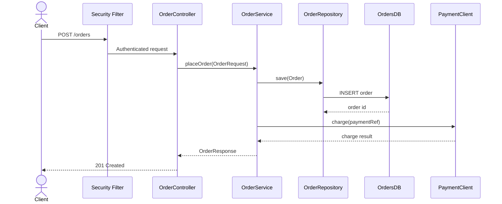
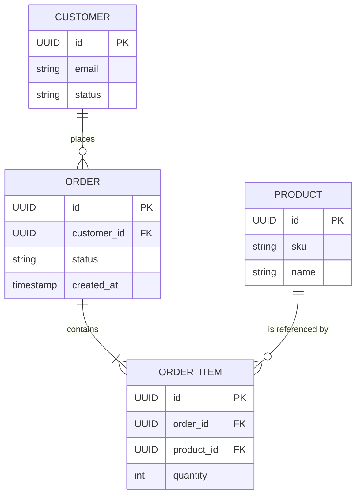
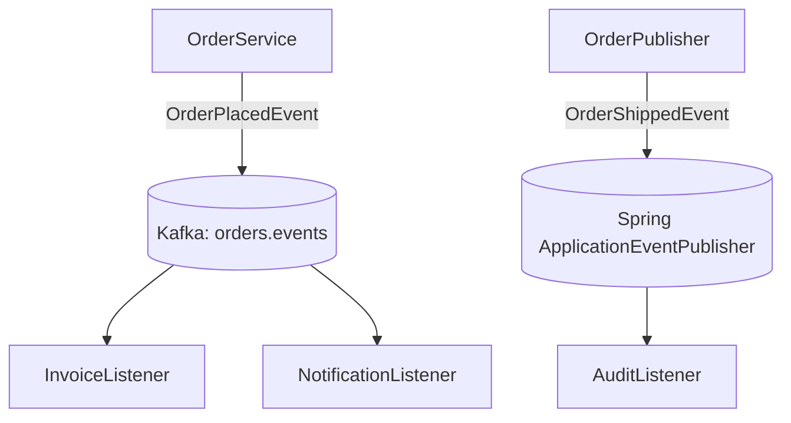
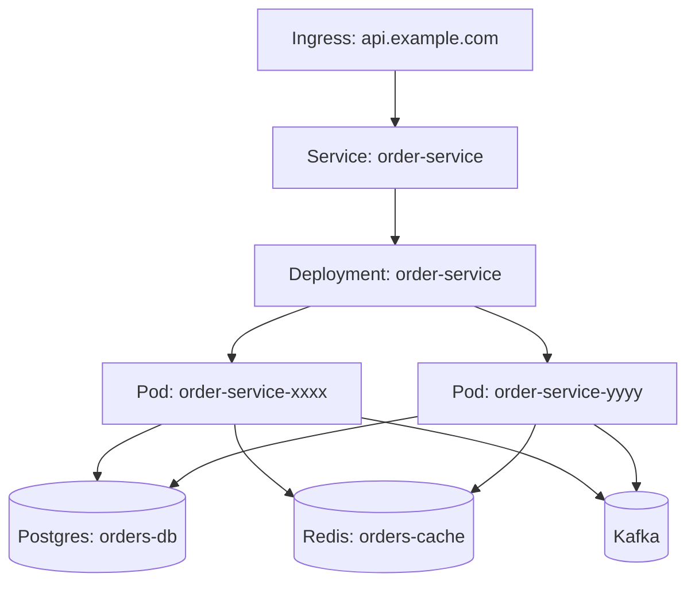
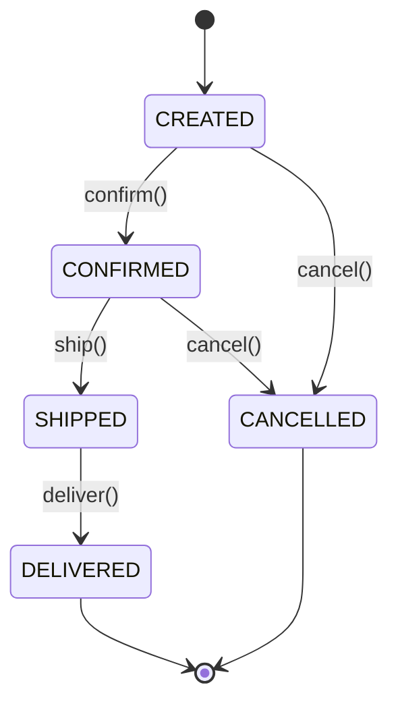
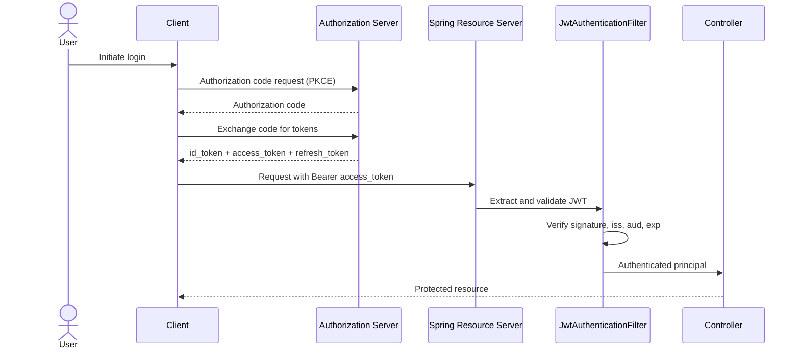

# Architecture Mapping

Generate every diagram below only when its **When to generate** rule matches the target codebase. Small applications skip diagrams whose "when to generate" rule does not match — do not emit empty placeholders or "N/A" diagrams.

## What to collect

Capture real names for:

- application entry point
- controllers
- services
- repositories
- entities and DTOs
- security filters and config
- caches
- databases
- message brokers
- HTTP or Feign clients
- scheduled jobs
- async executors
- exception handlers

## Component diagram

Use a Mermaid graph with actual class names.

Replace placeholders with discovered components.

## Sequence diagram

Choose one representative endpoint and map:

1. incoming request
2. auth and authorization
3. validation
4. controller entry
5. service orchestration
6. cache lookup if present
7. repository/database call
8. outbound integration if present
9. exception handling
10. final response

## Package dependency diagram

- **When to generate:** always. Every Spring Boot codebase has packages worth checking for layering.
- **What to capture:** the top-level packages under the application's base package (for example `com.acme.orders.web`, `com.acme.orders.service`, `com.acme.orders.repository`, `com.acme.orders.domain`, `com.acme.orders.config`) and the dependency arrows between them. Surface layering violations such as a controller package depending directly on a repository package, a domain package depending on a web package, or any cycle between packages.
- **Mermaid template:**

- **Naming rule:** use the actual fully-qualified package names discovered in the target codebase. Do not abbreviate to `web` / `service` / `repo`. If a violating edge exists (for example `web --> repository`), keep it in the diagram so the violation is visible.

## Per-flow sequence diagrams

- **When to generate:** for the top three to five business flows discovered in Step 2 of the workflow. These are in addition to the one representative sequence diagram already required by `SKILL.md`, not a replacement for it.
- **What to capture:** for each selected flow, the same ten-element shape used by the representative sequence diagram (request, auth, validation, controller, service, cache lookup if present, repository or database call, outbound integration if present, exception handling, response). Name the flow after the business action it performs (for example "Place order", "Cancel subscription", "Issue refund"), not after the HTTP route.
- **Mermaid template:**

- **Naming rule:** populate every participant with the real discovered class name (`OrderController`, `OrderService`, `PaymentClient`, etc.) and every message with the real method name or HTTP route. One diagram per flow, each in its own fenced Mermaid block.

## ER / domain model diagram

- **When to generate:** when JPA `@Entity` classes are present in the target codebase.
- **What to capture:** every `@Entity` class as a node, its primary key and notable fields, and the relationships derived from JPA annotations (`@OneToOne`, `@OneToMany`, `@ManyToOne`, `@ManyToMany`). Reflect cardinality and ownership (which side declares `mappedBy`) accurately.
- **Cross-reference:** see [reference/data-layer.md](data-layer.md) for fetch-strategy, cascade, and `open-in-view` review depth that informs how these relationships behave at runtime.
- **Mermaid template:**

- **Naming rule:** use the actual discovered entity class names (or table names if `@Table(name = ...)` overrides them) and the actual field names. Do not invent fields that are not present on the entity.

## Async / event flow diagram

- **When to generate:** when `@KafkaListener`, `@RabbitListener`, or `@EventListener` are present in the target codebase.
- **What to capture:** producers, the broker or in-process event bus, the topic / queue / exchange / event-type names, and every consumer. For Spring application events, capture the publisher (`ApplicationEventPublisher`) and each `@EventListener`-annotated method. For Kafka and Rabbit, capture the topic / queue name on the arrow.
- **Cross-reference:** see [reference/observability-and-resilience.md](observability-and-resilience.md) for how trace context, MDC, and correlation IDs propagate across these asynchronous boundaries.
- **Mermaid template:**

- **Naming rule:** use the actual discovered topic / queue / exchange names, the actual event class names, and the actual listener class and method names. Keep arrow labels equal to the message or event type so flows are traceable to source.

## Deployment diagram

- **When to generate:** when `Dockerfile`, `docker-compose.yml`, or Kubernetes manifests (`*.yaml` / `*.yml` under `k8s/`, `deploy/`, `manifests/`, or similar) are present.
- **What to capture:** the runnable units (containers, pods, deployments), how they are exposed (services, ingress, gateway), the data stores and brokers they depend on, and any sidecars or init containers. For Kubernetes, capture namespace, deployment name, service name, and ingress host. For Compose, capture the service name and the published port.
- **Cross-reference:** see [reference/cloud-native.md](cloud-native.md) for Dockerfile hardening, Kubernetes resource limits and probes, and secrets handling depth.
- **Mermaid template:**

- **Naming rule:** use the actual deployment, service, ingress, namespace, and host names from the manifests. For Compose, use the actual service names from `docker-compose.yml`. Do not invent infrastructure that is not declared.

## State diagram per entity

- **When to generate:** when an entity has an explicit lifecycle or status enum (for example `OrderStatus`, `PaymentState`, `SubscriptionStatus`). Generate one diagram per such entity.
- **What to capture:** every enum value as a state, every legal transition as an arrow labelled with the action or event that causes it, and the initial and terminal states. Derive transitions from the service / domain code that mutates the status field, not from speculation.
- **Mermaid template:**

- **Naming rule:** use the actual enum value names (matching case) and the actual method or event names that drive the transition. One diagram per entity, with the entity class name as the section heading.

## Auth / security flow diagram

- **When to generate:** when OAuth2, OIDC, or JWT are in use (for example `spring-boot-starter-oauth2-resource-server`, `spring-boot-starter-oauth2-client`, or a custom JWT filter is present).
- **What to capture:** the client, the identity provider or authorization server, the resource server (the Spring Boot app), the security filter chain, and the token lifecycle (issue, validate, refresh). Show where tokens are validated (signature, `iss`, `aud`, `exp`) and where authorization decisions are made.
- **Cross-reference:** see [reference/security.md](security.md) for JWT pitfalls, OAuth2 / OIDC flow review, and session management depth.
- **Mermaid template:**

- **Naming rule:** use the actual filter class name, the actual authorization server hostname or issuer URL, and the actual scopes or audiences declared in configuration. If the codebase uses opaque tokens with introspection rather than JWTs, replace the local validation step with the introspection call to the authorization server.

## Diagram rules

- Use actual discovered class names
- Keep arrows directional and readable
- Show only important components
- Prefer one clear diagram over one huge unreadable diagram
