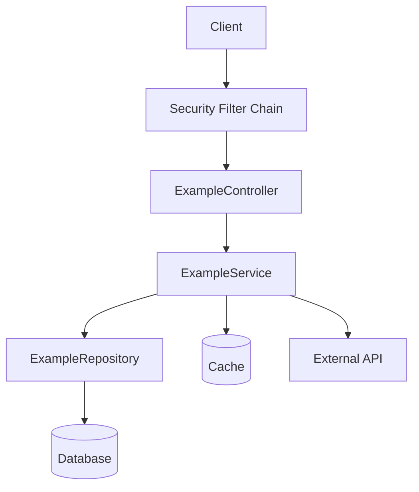
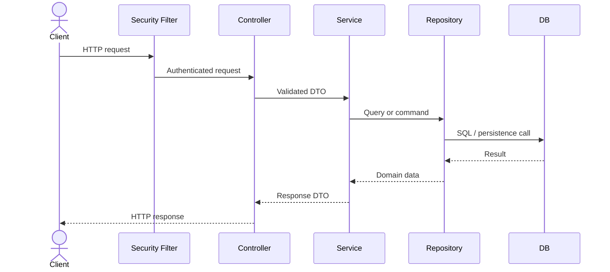

# Architecture Mapping

## What to collect

Capture real names for:

- application entry point
- controllers
- services
- repositories
- entities and DTOs
- security filters and config
- caches
- databases
- message brokers
- HTTP or Feign clients
- scheduled jobs
- async executors
- exception handlers

## Component diagram

Use a Mermaid graph with actual class names.

Replace placeholders with discovered components.

## Sequence diagram

Choose one representative endpoint and map:

1. incoming request
2. auth and authorization
3. validation
4. controller entry
5. service orchestration
6. cache lookup if present
7. repository/database call
8. outbound integration if present
9. exception handling
10. final response

## Diagram rules

- Use actual discovered class names
- Keep arrows directional and readable
- Show only important components
- Prefer one clear diagram over one huge unreadable diagram
