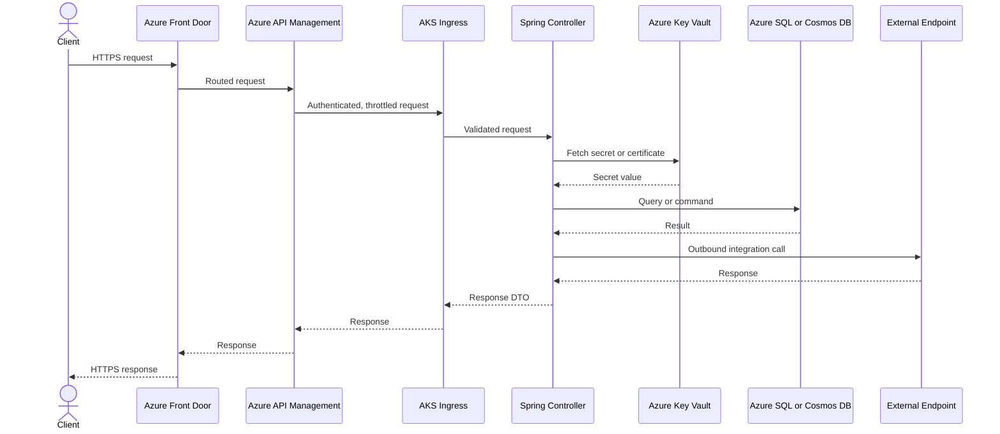

# Azure Resilience Review

## Scope

This file is the Azure-specific resilience reference for the skill. It covers how a Spring Boot application interacts with Microsoft Azure services, where those interactions can break, and what patterns make the application resilient and quickly recoverable on Azure. It drives a separate deliverable, `azure-resilience-report.md`, in addition to the main `spring-boot-audit-report.md`.

This file does **not** cover general containerization (that lives in [reference/cloud-native.md](cloud-native.md)), generic resilience patterns such as the catalog of Resilience4j retry / circuit breaker / bulkhead / rate limiter / time limiter (that lives in [reference/observability-and-resilience.md](observability-and-resilience.md)), or general-purpose component, sequence, ER, async, deployment, state, and auth diagrams (those live in [reference/architecture.md](architecture.md)). For Managed Identity, Key Vault secrets, and OAuth2 / Azure AD authentication review depth, cross-reference [reference/security.md](security.md).

Cross-references: [reference/cloud-native.md](cloud-native.md), [reference/observability-and-resilience.md](observability-and-resilience.md), [reference/architecture.md](architecture.md), [reference/security.md](security.md).

## Detection signals

Load this reference only when the target codebase shows one or more of the following Azure signals. Treat the signals as prose evidence; do not generate regex, AST queries, or ripgrep recipes for them.

- **Azure SDK dependencies in `pom.xml` or `build.gradle`:** any artifact under the `com.azure:*` or `com.microsoft.azure:*` group, the Spring starters `azure-spring-boot-starter-*`, identity (`azure-identity`), Key Vault (`azure-security-keyvault-secrets`, `azure-security-keyvault-certificates`, `azure-security-keyvault-keys`), storage (`azure-storage-blob`, `azure-storage-queue`, `azure-storage-file-share`, and the rest of `azure-storage-*`), messaging (`azure-messaging-servicebus`, `azure-messaging-eventhubs`), data (`azure-cosmos`), monitor (`azure-monitor-*`), and Application Insights (`applicationinsights-*`).
- **Configuration keys** in `application.yml`, `application.properties`, or any Spring profile under the namespaces `azure.*` and `spring.cloud.azure.*` (for example `spring.cloud.azure.keyvault.secret.endpoint`, `spring.cloud.azure.servicebus.namespace`, `azure.cosmos.uri`).
- **Infrastructure-as-code** declaring Azure resources: ARM and Bicep templates (`*.bicep`, `azuredeploy.json`, `main.bicep` and similar), and Terraform resources whose type begins with `azurerm_*` or `azapi_*`.
- **Container and Kubernetes references** to Azure-owned hosts and identities: image registries on `*.azurecr.io` or `mcr.microsoft.com`, references to AKS-managed-identity tokens (commonly named `mi-*`), and AKS-specific annotations (`kubernetes.azure.com/*`, `azure.workload.identity/*`).
- **Azure App Service evidence:** `web.config` files in the repository, references to `*.azurewebsites.net` hostnames, and App Service deployment configuration in CI.
- **CI pipeline steps** that invoke Azure tooling: `azure/login`, `azure/cli`, `azure/webapps-deploy`, `aks-set-context`, and similar published Azure GitHub Actions or Azure DevOps tasks.

If none of these signals are present, skip loading this reference and do not produce `azure-resilience-report.md`.

## Review areas

For every Azure service the application depends on, examine:

- the service's purpose in the application
- the breaking points between the application and that service
- the resilience patterns that should be applied at that boundary
- the codebase evidence that confirms whether each pattern is or is not applied

The per-service subsections below capture this in a consistent four-bullet shape.

## Per-service review areas

Each subsection follows the same four-bullet shape: **Purpose**, **Common breaking points**, **Resilience patterns**, **Codebase evidence**. The breaking points cover, where applicable to the service, transient connectivity loss, throttling, authentication and Managed Identity token failures, regional outages, and DNS resolution failures. The resilience patterns cover, where applicable, retry with backoff, circuit breaker, fallback or cache, graceful degradation, idempotent operations, health checks, and secret-rotation handling.

### Azure Key Vault

- **Purpose:** central store for application secrets, certificates, and cryptographic keys; typically accessed via `azure-security-keyvault-secrets` / `-certificates` / `-keys` and authenticated with Managed Identity or a service principal.
- **Common breaking points:** transient connectivity loss to the vault endpoint, throttling under burst secret reads at startup, Managed Identity token acquisition failure or token expiry, regional outage of the vault region, DNS resolution failure for `*.vault.azure.net`, and stale secrets after rotation.
- **Resilience patterns:** retry with exponential backoff and jitter on transient errors; circuit breaker around vault reads to avoid stampede; in-memory secret cache with a bounded TTL aligned to the rotation policy; graceful degradation that fails closed for sensitive operations and fails open only for non-critical reads where appropriate; secret-rotation handling that refreshes cached secrets on signal or TTL expiry rather than only at startup; health probes that do not depend on a successful Key Vault round-trip.
- **Codebase evidence:** record the file path and line number of every `SecretClient` / `CertificateClient` / `KeyClient` construction, every `@Value("${...}")` bound to a Key Vault property, every `spring.cloud.azure.keyvault.*` configuration block, and every cache or refresh policy applied to those reads.

### Azure App Service

- **Purpose:** PaaS host for the Spring Boot application, often surfaced at `*.azurewebsites.net` with deployment slots for staging and production.
- **Common breaking points:** platform restarts and slot swaps interrupting in-flight requests, cold starts after scale-out, transient connectivity loss to backing services, throttling on outbound calls, regional outage, DNS resolution failures, and managed-identity token failures during slot swaps.
- **Resilience patterns:** graceful shutdown wired to App Service shutdown signals so in-flight requests drain; readiness and liveness probes that fail fast on dependency outages; retry with backoff on outbound calls; idempotent handlers so retried requests after a slot swap do not double-apply; slot-warming before swap; correct handling of `X-Forwarded-*` headers behind the App Service front end.
- **Codebase evidence:** record file path and line number of `web.config`, App Service deployment configuration, graceful-shutdown wiring (e.g., `ContextClosedEvent` listeners, `server.shutdown=graceful`), readiness/liveness configuration, and any slot-aware logic.

### Azure Kubernetes Service (AKS)

- **Purpose:** managed Kubernetes cluster hosting the Spring Boot deployment, typically fronted by AKS Ingress and authenticated to other Azure services via Workload Identity or AKS Pod Identity.
- **Common breaking points:** node-pool eviction and pod restarts, throttling against the Kubernetes API server, Workload Identity token acquisition failures, regional or zonal outage of the cluster, DNS resolution failures via CoreDNS, and image-pull failures from `*.azurecr.io`.
- **Resilience patterns:** liveness, readiness, and startup probes that exercise real dependencies without cascading; pod disruption budgets and topology spread across zones; retry with backoff on outbound calls; circuit breaker around dependent services; horizontal pod autoscaling tuned to realistic latency; graceful shutdown via `preStop` hooks plus Spring graceful shutdown; idempotent handlers so pod restarts do not double-apply.
- **Codebase evidence:** record the file path and line number of Kubernetes manifests under `k8s/`, `helm/`, or `manifests/`, AKS-specific annotations (`kubernetes.azure.com/*`, `azure.workload.identity/*`), probe definitions, PDBs, and Workload Identity configuration.

### Azure Storage (Blob, Queue, Table)

- **Purpose:** durable object, queue, and key/value storage; typically accessed via `azure-storage-blob`, `azure-storage-queue`, and the table SDK.
- **Common breaking points:** transient connectivity loss, request throttling (HTTP 503 with `x-ms-request-id`), authentication failures with Managed Identity or SAS tokens, regional outage of the storage account, DNS resolution failures for `*.blob.core.windows.net` / `*.queue.core.windows.net` / `*.table.core.windows.net`, and SAS token expiry mid-operation.
- **Resilience patterns:** retry with exponential backoff and jitter (the SDK retry policy is the floor, not the ceiling); circuit breaker around storage operations to avoid worker-thread starvation; idempotent writes using deterministic blob names or conditional headers (`If-None-Match`, `If-Match`); fallback to a secondary read endpoint where the account is RA-GRS; SAS-token refresh ahead of expiry; health probes that exercise a cheap blob/queue/table operation.
- **Codebase evidence:** record file path and line number of every `BlobServiceClient`, `QueueServiceClient`, and `TableServiceClient` construction, the retry policy attached to each, and the credential type in use (Managed Identity, SAS, account key).

### Azure Service Bus

- **Purpose:** enterprise message broker for queues and topics, used for asynchronous workflows; accessed via `azure-messaging-servicebus`.
- **Common breaking points:** transient connectivity loss, throttling on namespace throughput units, Managed Identity token failures, regional outage, DNS resolution failure, message lock expiry under slow consumers, and dead-letter queue growth.
- **Resilience patterns:** retry with backoff on send, with idempotency keys so retried sends do not duplicate effects on the consumer side; circuit breaker around send operations; message-lock renewal for long-running handlers; bounded prefetch tuned to handler throughput; dead-letter queue monitoring with replay tooling; geo-disaster-recovery alias on the namespace for regional failover; idempotent consumers keyed on `MessageId` or a business key.
- **Codebase evidence:** record file path and line number of every `ServiceBusSenderClient` / `ServiceBusReceiverClient` / `ServiceBusProcessorClient` construction, every `@ServiceBusListener` or processor handler, the lock-renewal policy, and the prefetch count.

### Azure Event Hubs

- **Purpose:** high-throughput event ingestion and stream processing; accessed via `azure-messaging-eventhubs`.
- **Common breaking points:** transient connectivity loss, throttling at throughput-unit / processing-unit limits, Managed Identity token failures, regional outage, DNS resolution failure, partition-owner contention with the checkpoint store, and checkpoint loss leading to message replay.
- **Resilience patterns:** retry with backoff on send and receive; checkpointing on a durable store (typically Azure Storage) with a cadence tuned to recovery objectives; idempotent consumers because at-least-once delivery is the contract; consumer-group isolation per workload; partition-key strategy that distributes load without hot partitions; geo-disaster-recovery alias for regional failover; bounded buffer between receive and processing.
- **Codebase evidence:** record file path and line number of every `EventHubProducerClient` / `EventHubConsumerClient` / `EventProcessorClient` construction, the checkpoint store configuration, the consumer group, and the partition-key derivation.

### Azure Cosmos DB

- **Purpose:** globally distributed multi-model database; accessed via `azure-cosmos` or `spring-cloud-azure-starter-data-cosmos`.
- **Common breaking points:** transient connectivity loss, throttling (HTTP 429 with `x-ms-retry-after-ms`) when request units are exhausted, Managed Identity token failures, regional outage, DNS resolution failure, and consistency-level surprises during failover.
- **Resilience patterns:** honor the SDK's `x-ms-retry-after-ms` rather than fixed retry timing; circuit breaker around hot containers; preferred-region list with automatic failover; idempotent upserts using deterministic ids; bulk operations with backoff on partial failure; consistency level explicitly chosen and documented; health probes that read a small known item rather than scanning a container.
- **Codebase evidence:** record file path and line number of every `CosmosClient` / `CosmosAsyncClient` construction, the preferred-regions list, the consistency level, the request-unit budget, and the retry policy.

### Azure SQL

- **Purpose:** managed relational database; accessed via JDBC with the Microsoft JDBC driver, often through Spring Data JPA.
- **Common breaking points:** transient connectivity loss (the well-known Azure SQL transient error codes such as 40197, 40501, 40613, 49918, 49919, 49920), throttling under DTU/vCore exhaustion, authentication failures with Managed Identity or AAD, regional outage with failover groups, DNS resolution failure, and connection-pool starvation during failover.
- **Resilience patterns:** retry with exponential backoff and jitter on the documented transient error codes; circuit breaker around database operations to prevent worker-thread starvation; failover-group connection string so reads and writes follow the active replica; HikariCP pool sized to realistic concurrency with leak detection enabled; idempotent writes using natural keys or `MERGE` patterns; readiness probe that issues a cheap `SELECT 1` against the active replica; long-running transactions broken up to reduce blocking during failover.
- **Codebase evidence:** record file path and line number of the JDBC URL (failover-group hostname vs. server hostname), the HikariCP configuration, the retry handler, and every `@Transactional` boundary that wraps remote calls.

### Azure Application Insights

- **Purpose:** application performance monitoring and distributed tracing; usually enabled via the `applicationinsights-agent-*` Java agent or the `applicationinsights-spring-boot-starter`.
- **Common breaking points:** transient connectivity loss to the ingestion endpoint, throttling on telemetry ingestion, authentication failures with the connection string or Managed Identity, regional outage, DNS resolution failure, and telemetry buffer overflow during outages.
- **Resilience patterns:** local buffering with a bounded queue and disk spill; retry with backoff on telemetry export; sampling tuned to volume so cost and ingestion limits are respected; graceful degradation so application functionality never blocks on telemetry; secret-rotation handling for the connection string; health probes that do not depend on Application Insights being reachable.
- **Codebase evidence:** record file path and line number of the agent configuration (`applicationinsights.json`), the connection string source, the sampling configuration, and any custom `TelemetryClient` usage.

### Azure Managed Identity

- **Purpose:** keyless authentication from the application to other Azure services; available as system-assigned or user-assigned identity, with Workload Identity for AKS.
- **Common breaking points:** token acquisition failure when the identity endpoint (IMDS, Workload Identity webhook) is unreachable, throttling on the token endpoint at startup or burst, missing role assignments on the target resource, token expiry mid-operation, regional outage of the identity service, and DNS resolution failure for the metadata endpoint.
- **Resilience patterns:** rely on the SDK token cache rather than fetching a token per call; refresh tokens before expiry rather than after a 401; retry with backoff on token endpoint failures; circuit breaker around any custom token-fetching code; chained credential (`DefaultAzureCredential` or an explicit `ChainedTokenCredential`) so local development and production share one code path; clear failure mode that surfaces missing role assignments rather than retrying forever.
- **Codebase evidence:** record file path and line number of every `DefaultAzureCredential`, `ManagedIdentityCredential`, `WorkloadIdentityCredential`, or `ChainedTokenCredential` construction, every Workload Identity annotation on a Kubernetes service account, and the role assignments declared in IaC.

### Azure Front Door

- **Purpose:** global Layer 7 entry point providing TLS termination, WAF, caching, and global load balancing across regions.
- **Common breaking points:** origin-health-probe failures causing traffic to the wrong region, WAF rule false positives blocking legitimate traffic, transient connectivity loss between Front Door and origins, throttling on WAF rule evaluation, regional outage of an origin, and DNS resolution failures at the edge.
- **Resilience patterns:** multi-region origin groups with health-based routing; retry with backoff at the application layer for upstream Front Door retries; idempotent handlers because Front Door retries are visible to the application as repeated requests; correct propagation and trust of `X-Forwarded-*` and `X-Azure-FDID` headers; cache rules tuned to safe content; WAF rules tuned with monitor mode before block mode.
- **Codebase evidence:** record file path and line number of Front Door configuration in IaC (Bicep or Terraform), the origin host names, the health probe path, the WAF policy reference, and the application's handling of `X-Azure-FDID` for origin lockdown.

### Azure API Management

- **Purpose:** API gateway providing authentication, throttling, transformation, and developer-portal exposure in front of the application.
- **Common breaking points:** policy-evaluation failures, throttling at the API or product level, JWT validation failures during AAD outage, transient connectivity loss between APIM and the backend, regional outage, DNS resolution failure, and certificate expiry on backend mTLS.
- **Resilience patterns:** retry policy in APIM tuned to backend characteristics; circuit breaker policy at the API level; rate-limit policies at product and subscription level; idempotency keys honored across APIM retries; backend certificate rotation tracked; multi-region APIM with traffic management for failover; backend health probes via APIM's named-values-driven URLs.
- **Codebase evidence:** record file path and line number of APIM policy XML in the repository, the named values used for backend URLs and secrets, the rate-limit and retry policy configuration, and the backend authentication scheme.

### Azure Cache for Redis

- **Purpose:** managed Redis used for caching, session storage, distributed locking, and rate limiting.
- **Common breaking points:** transient connectivity loss, throttling under memory or CPU pressure, authentication failures with access keys or AAD, failover events between primary and replica, regional outage, DNS resolution failure, and key eviction under memory pressure.
- **Resilience patterns:** retry with backoff on Redis operations using the Lettuce or Jedis configuration; circuit breaker so cache outages do not cascade into request latency; cache-aside pattern with safe fallback to the source of truth; bounded operation timeouts so a slow Redis does not stall worker threads; key TTLs aligned to data freshness needs; idempotent cache-warming jobs; geo-replication for regional failover where supported.
- **Codebase evidence:** record file path and line number of `RedisConnectionFactory`, `LettuceClientConfiguration` / `JedisClientConfiguration`, the timeouts and retry policy, the cache-aside wrappers, and any distributed-lock usage.

### Azure Container Apps

- **Purpose:** serverless container host with Dapr and KEDA integration; an alternative to AKS for event-driven workloads.
- **Common breaking points:** scale-to-zero cold starts, scale-out delays under burst load, transient connectivity loss to backing services, throttling on the Container Apps environment, Managed Identity token failures, regional outage, and DNS resolution failures.
- **Resilience patterns:** minimum replica count above zero for latency-sensitive paths; readiness probes that gate traffic during cold start; retry with backoff on outbound calls; idempotent handlers because scale events can interrupt in-flight work; KEDA scale rules tuned to realistic queue depth; revision-based traffic shifting for safe rollouts.
- **Codebase evidence:** record file path and line number of Container Apps IaC (Bicep or Terraform), the scale rules, the probe definitions, the revision strategy, and the Managed Identity binding.

### Azure Functions

- **Purpose:** serverless compute, often used alongside the Spring Boot application for event triggers, scheduled jobs, or integration glue.
- **Common breaking points:** cold starts on the Consumption plan, throttling at the host level, transient connectivity loss to triggers (Service Bus, Event Hubs, Storage queues), Managed Identity token failures, regional outage, DNS resolution failure, and host shutdowns mid-invocation.
- **Resilience patterns:** Premium plan or always-ready instances for latency-sensitive triggers; idempotent handlers because retried invocations are normal; bindings configured with poison-message handling and dead-letter queues; retry policies on the function decorator; durable functions for multi-step orchestrations needing checkpointing; graceful-shutdown hooks that flush in-flight work.
- **Codebase evidence:** record file path and line number of `function.json` (or attribute-based bindings in Java), the host plan declared in IaC, the retry-policy configuration, and the dead-letter handling.

### Azure Application Gateway

- **Purpose:** regional Layer 7 load balancer with WAF, often used in front of AKS or VM scale sets when Front Door is not in the path.
- **Common breaking points:** backend health-probe failures taking pools out of rotation, WAF rule false positives, certificate expiry on listeners or backend pools, transient connectivity loss between gateway and backend, throttling, zonal outage, and DNS resolution failure.
- **Resilience patterns:** zone-redundant deployment; backend health probes that exercise real dependencies; multi-listener configuration with TLS termination and end-to-end TLS where required; WAF rules tuned with monitor mode before block mode; certificate rotation automated through Key Vault; idempotent handlers because gateway-level retries are possible.
- **Codebase evidence:** record file path and line number of Application Gateway IaC, the listener and backend pool definitions, the probe paths, the WAF policy, and the certificate references in Key Vault.

### Azure Log Analytics

- **Purpose:** centralized log store backing Azure Monitor and Application Insights workspace-based mode; queried with KQL.
- **Common breaking points:** ingestion throttling, transient connectivity loss to the ingestion endpoint, authentication failures with the workspace key or Managed Identity, regional outage of the workspace region, DNS resolution failure, and ingestion delay during incident response.
- **Resilience patterns:** local log buffering with a bounded queue; sampling tuned to ingestion limits; retry with backoff on the ingestion API; structured logging so KQL queries remain useful; secret-rotation handling for the workspace key; alerts that do not depend on Log Analytics being healthy (use Azure Monitor metrics for liveness signals).
- **Codebase evidence:** record file path and line number of the diagnostic settings in IaC, the log appender configuration, the sampling settings, and the secret source for the workspace key.

### Azure Monitor

- **Purpose:** the umbrella metrics, alerts, and diagnostic-settings platform for Azure resources and the application.
- **Common breaking points:** alert-rule misconfiguration causing missed signals, metric ingestion delay, transient connectivity loss for custom metrics, throttling on custom-metric ingestion, regional outage of the monitor region, and DNS resolution failure.
- **Resilience patterns:** alerts wired to action groups with multiple channels (email, SMS, webhook, ITSM); diagnostic settings on every Azure resource the application depends on; metric-based alerts for liveness in addition to log-based alerts; runbooks tied to alerts; secret-rotation handling for any webhook receivers; health probes that do not depend on Azure Monitor being healthy.
- **Codebase evidence:** record file path and line number of diagnostic-settings IaC, alert-rule IaC, action-group definitions, custom-metric publishers in code, and any runbook references in the repository.

## End-to-end Azure flow diagram

Generate one Mermaid `sequenceDiagram` per top critical request flow discovered during the audit, with Azure components inline as participants. These diagrams are owned by this file and are produced *in addition to* the general-purpose sequence diagrams in [reference/architecture.md](architecture.md).

The template below shows the canonical shape: Client → Azure Front Door → Azure API Management → AKS Ingress → Spring Controller → Azure Key Vault (secret or certificate fetch) → Azure SQL or Azure Cosmos DB → External Endpoint → response. Adapt the participants to the services actually present in the target codebase (for example replace `AKS Ingress` with App Service or Container Apps if those host the application, drop Front Door if APIM is the global entry, drop Key Vault from the diagram if the flow does not fetch a secret).

Replace every placeholder participant label with the real discovered Azure resource name from the target codebase — for example `fd-payments-prod`, `apim-payments-prod-eastus`, `aks-payments-prod`, `OrderController`, `kv-payments-prod`, `sqldb-orders-prod`, and the actual outbound endpoint hostname. Use the actual HTTP method, route, and message labels rather than the generic words above.

Emit Mermaid text only. Do not produce PNG, SVG, or any other rendered image.

## Breaking-point catalog

For every breaking point identified during the per-service review, record one row in a Markdown table with exactly five columns:

| Trigger Condition | Blast Radius | Current Mitigation in Code | Recommended Mitigation | Severity (P0–P3) |
|---|---|---|---|---|
| What event causes the failure (for example "Cosmos DB returns HTTP 429 with `x-ms-retry-after-ms`"). | Which user-facing flows or background jobs are affected, and how many users or requests that represents. | What the codebase does today (for example "Spring retry template with three fixed-interval retries at `OrderService.java:142`"), or "none" if there is no mitigation. | The concrete change to apply (for example "honor `x-ms-retry-after-ms` from the SDK exception and switch to exponential backoff with jitter"). | One of P0, P1, P2, P3 using the same scheme as the rest of the skill. |

One row per breaking point. Keep cells short and prose-shaped. Cross-reference each row, where applicable, to a matching recommendation in the section below. Severity uses the existing P0–P3 buckets without redefinition.

## Resilience improvement recommendations

Pair each row of the Breaking-point catalog with a concrete recommendation drawn from the catalog below. For Resilience4j pattern depth (retry, circuit breaker, bulkhead, rate limiter, time limiter), cross-reference [reference/observability-and-resilience.md](observability-and-resilience.md) rather than restating the catalog.

- **Resilience4j patterns at Azure boundaries:** wrap calls to Azure SQL, Cosmos DB, Service Bus, Event Hubs, Storage, Key Vault, and Redis with retry, circuit breaker, bulkhead, and time limiter as appropriate. Tune timeouts to be shorter than upstream timeouts so back-pressure flows in the right direction.
- **Idempotency keys for mutating endpoints:** require an `Idempotency-Key` header (or equivalent business key) on every mutating endpoint that may be retried by Front Door, APIM, App Service slot swaps, or AKS pod restarts. Persist the key with the result so retries return the original response.
- **Asynchronous retry queues:** for outbound calls that fail after the in-process retry budget, enqueue a retry message to Azure Service Bus or Storage queues with an exponential delay. This drains transient outages without consuming request threads.
- **Multi-region considerations:** declare a primary and secondary region for each stateful service (Cosmos DB preferred regions, SQL failover groups, Storage RA-GRS, Service Bus geo-DR, Redis geo-replication). Document the application's behavior during failover and verify it with periodic drills.
- **Health probes:** define liveness probes that detect process death only and readiness probes that gate traffic on dependency health. Avoid making readiness depend on Key Vault, Application Insights, or other non-critical dependencies, which would amplify outages.
- **Traffic shifting:** use Front Door, APIM, App Service slot swaps, AKS service mesh, or Container Apps revisions to shift a small percentage of traffic during rollouts and rollback automatically on error-rate or latency breach.
- **Blue-green and canary deployments:** prefer blue-green for App Service (slot swap with warm-up) and canary for AKS / Container Apps (gradual revision weight increase). Wire both to the same readiness probes used at runtime.
- **Secret-cache TTL:** cache Key Vault secrets in memory with a TTL shorter than the rotation cadence and a refresh-ahead policy. Surface a metric for cache age so stale-secret incidents are observable.
- **Managed Identity token-refresh handling:** rely on the SDK token cache, refresh proactively before expiry, and circuit-break on repeated token endpoint failures. Treat missing role assignments as a non-retryable error rather than a transient one.

## Severity guidance

Use the existing P0–P3 scheme without redefinition. Findings against Azure boundaries map to severity using the same meanings as elsewhere in the skill.

### P0

- a production secret hardcoded instead of read from Key Vault
- a single-region stateful service (Azure SQL, Cosmos DB, Storage) with no failover-group / preferred-regions / RA-GRS configuration and no documented recovery plan
- an outbound call to a critical Azure dependency with no timeout, no retry, and no circuit breaker, on a request path
- Managed Identity not configured where role assignments are present (forcing connection strings or account keys in production)
- App Service or AKS readiness probe that always returns success regardless of dependency state on a critical path

### P1

- retry with fixed intervals against services that publish a `Retry-After` value (Cosmos DB `x-ms-retry-after-ms`, Storage 503, Service Bus throttling)
- mutating endpoints with no idempotency key, exposed behind Front Door / APIM / App Service slot swaps where retries are visible to the backend
- Key Vault secrets fetched only at startup with no rotation handling
- Service Bus or Event Hubs consumers without idempotent handling, given at-least-once delivery
- AKS deployments without pod disruption budgets or zone topology spread

### P2

- Resilience4j configuration present but tuned with timeouts longer than upstream gateway timeouts, defeating back-pressure
- Application Insights / Log Analytics ingestion with no sampling and unbounded buffers
- WAF rules in block mode without a prior monitor-mode soak
- HikariCP pool sized far above realistic concurrency, masking connection-pool starvation during failover
- Redis usage without bounded operation timeouts

### P3

- missing structured logging fields that would aid KQL queries
- alert rules without action-group escalation paths
- diagnostic settings present on some Azure resources but not all
- documentation gaps around rotation cadence, failover drills, or runbooks

## Evidence rules

Every Azure resilience finding records:

- file path
- line number when possible
- why the issue matters (the breaking point it leaves open, the user-facing impact, or the recovery objective it violates)
- exact remediation (the specific configuration change, code change, or IaC change to apply)

These rules match the evidence rules used in [reference/security.md](security.md) and the rest of the skill.

## Resilience report deliverable

Produce `azure-resilience-report.md` *in addition to* the main `spring-boot-audit-report.md` whenever the Azure detection signals above are present in the target codebase. Skip producing it otherwise; do not emit an empty stub.

The report follows this fixed shape:

- `## Project and Azure footprint summary` — one short paragraph naming the application under audit, the Azure services it depends on (with the real discovered resource names), and the deployment topology in one or two sentences.
- `## End-to-end Azure flow diagram(s)` — one Mermaid `sequenceDiagram` block per top critical request flow, populated with the real discovered Azure resource names per the End-to-end Azure flow diagram section above. Mermaid text only — no images.
- `## Breaking-point catalog` — a single Markdown table with the columns defined in the Breaking-point catalog section above (Trigger Condition, Blast Radius, Current Mitigation, Recommended Mitigation, Severity). One row per identified breaking point.
- `## Prioritized resilience recommendations` — recommendations grouped by H3 buckets `### P0`, `### P1`, `### P2`, `### P3`, in that order. Each bullet is a concrete recommendation paired, where applicable, with a row in the Breaking-point catalog.
- `## Links to main audit report` — a short list of relative-path links pointing back at the relevant findings in `spring-boot-audit-report.md` so the two deliverables are cross-navigable.

The report is Markdown only. It uses the same P0–P3 scheme as the rest of the skill — no new severity levels are introduced. It contains no executable code, no SAST/SCA tooling output, no SBOM/supply-chain content, and no regex / AST / ripgrep recipes.
