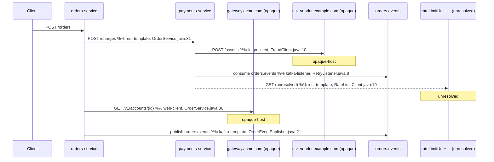

# Worked Example

## Scope and status

This file walks through one end-to-end run of the `code-based-request-tracing` skill against two small Spring Boot services, one Kafka topic, one opaque gateway hop, and one user-supplied host mapping. It shows enough of the **inputs** (directory layout, `application.yml` excerpts, controller and client snippets) for a reader to follow the detection step by step, and it shows the **outputs** (`tracing-report.md` fragments and a `tracing-graph.json` fragment) that the Agent should produce for those inputs.

> **This example is illustrative, not a test fixture.** It is not committed as runnable source, it is not exercised by any automated harness, and it is not the source of truth for any field shape. The canonical schema lives in [tracing-graph-schema.md](tracing-graph-schema.md); the canonical report shape lives in [output-format.md](output-format.md). If this file ever drifts from those two, the schema and output-format files win.

The example is sized so every closed-enum value documented in the schema appears at least once, so a reader has a single place to see all of them in context:

- `kind`: `rest-template`, `web-client`, `feign-client`, `kafka-listener`, `kafka-template`.
- `status`: `resolved-service`, `opaque-host`, `kafka-topic`, `unresolved`.

## The scenario

Two services live in separate Azure DevOps repositories on the analyst's machine:

- `orders-service` accepts `POST /orders`, charges the customer through `payments-service`, looks up account metadata through an opaque gateway, and publishes a domain event to Kafka.
- `payments-service` accepts `POST /charges`, runs a fraud check via a Feign client against an external risk vendor, consumes its own retry topic, and reads a remote rate-limit URL from a runtime environment variable that is **not** committed to the repo (so the call stays `unresolved`).

The user supplies a small `host-mappings.yaml` that resolves `payments.internal.acme.com` to `payments-service`. They do **not** supply a mapping for `gateway.acme.com`, so that hop stays opaque.

## Inputs

### Directory layout

```text
~/work/
├── orders-service/
│   ├── pom.xml
│   └── src/main/
│       ├── java/com/acme/orders/
│       │   ├── web/OrderController.java
│       │   ├── service/OrderService.java
│       │   └── messaging/OrderEventPublisher.java
│       └── resources/
│           └── application.yml
├── payments-service/
│   ├── pom.xml
│   └── src/main/
│       ├── java/com/acme/payments/
│       │   ├── web/ChargeController.java
│       │   ├── service/RetryListener.java
│       │   ├── service/RateLimitClient.java
│       │   └── client/FraudClient.java
│       └── resources/
│           └── application.yml
└── host-mappings.yaml
```

Both repos pass the Spring Boot scope check (each `pom.xml` declares the `spring-boot-starter-parent` parent and the `spring-boot-maven-plugin`); see [detection-patterns.md](detection-patterns.md#spring-boot-scope-check). `pom.xml` files are omitted from this example for brevity.

The user invokes the skill with the input list `["~/work/orders-service", "~/work/payments-service"]`, the host mapping file `~/work/host-mappings.yaml`, and accepts the default output directory `./tracing-output/`.

### `orders-service/src/main/resources/application.yml`

```yaml
spring:
  application:
    name: orders-service

payments:
  base-url: https://payments.internal.acme.com

accounts:
  gateway-url: https://gateway.acme.com/v1/accounts

kafka:
  topics:
    orders-events: orders.events
```

### `payments-service/src/main/resources/application.yml`

```yaml
spring:
  application:
    name: payments-service

fraud:
  client-url: https://risk-vendor.example.com
```

Note: `payments-service`'s rate-limit URL is **not** declared in `application.yml`. It is read from an environment variable at runtime (`@Value("${RATE_LIMIT_URL}")`), so the Agent cannot reduce the expression to a concrete string from sources within the repo and must record `status: unresolved`.

### `orders-service` — controller (`web/OrderController.java`)

```java
package com.acme.orders.web;

import com.acme.orders.service.OrderService;
import org.springframework.web.bind.annotation.*;

@RestController
@RequestMapping("/orders")
public class OrderController {

    private final OrderService orderService;

    public OrderController(OrderService orderService) {
        this.orderService = orderService;
    }

    @PostMapping
    public OrderResponse placeOrder(@RequestBody OrderRequest req) {  // line 17
        return orderService.place(req);
    }
}
```

The Agent extracts one Inbound_Endpoint here. After path concatenation, `serviceName: orders-service`, `httpMethod: POST`, `path: /orders`, `evidenceFile: src/main/java/com/acme/orders/web/OrderController.java`, `evidenceLine: 17`.

### `orders-service` — outbound HTTP clients (`service/OrderService.java`)

```java
package com.acme.orders.service;

import com.acme.orders.messaging.OrderEventPublisher;
import org.springframework.beans.factory.annotation.Value;
import org.springframework.stereotype.Service;
import org.springframework.web.client.RestTemplate;
import org.springframework.web.reactive.function.client.WebClient;

@Service
public class OrderService {

    private final RestTemplate restTemplate;
    private final WebClient accountsClient;
    private final OrderEventPublisher publisher;

    @Value("${payments.base-url}")
    private String paymentsBaseUrl;

    @Value("${accounts.gateway-url}")
    private String accountsGatewayUrl;

    public OrderService(RestTemplate restTemplate,
                        WebClient.Builder builder,
                        OrderEventPublisher publisher) {
        this.restTemplate = restTemplate;
        this.accountsClient = builder.build();
        this.publisher = publisher;
    }

    public OrderResponse place(OrderRequest req) {
        ChargeResponse charge = restTemplate.postForObject(            // line 31
            paymentsBaseUrl + "/charges",
            req,
            ChargeResponse.class);

        Account account = accountsClient.get()                          // line 36
            .uri(accountsGatewayUrl + "/{id}", req.accountId())
            .retrieve()
            .bodyToMono(Account.class)
            .block();

        publisher.publishOrderPlaced(req, charge, account);             // line 42
        return new OrderResponse(charge.id());
    }
}
```

This file produces three Outbound_Calls:

1. `kind: rest-template` at line 31. `targetRaw: paymentsBaseUrl + "/charges"`, `httpMethod: POST`. After resolution, `targetResolved: https://payments.internal.acme.com/charges` (via `@Value` + `application.yml`). The host mapping resolves it to `payments-service`, so `status: resolved-service` and `mappingApplied` is set.
2. `kind: web-client` at line 36. `targetRaw: accountsGatewayUrl + "/{id}"`, `httpMethod: GET`. After resolution, `targetResolved: https://gateway.acme.com/v1/accounts/{id}`. No host mapping covers `gateway.acme.com`, so `status: opaque-host`.
3. `publisher.publishOrderPlaced(...)` is a method invocation on a service bean, not an outbound call. The actual Kafka send happens inside `OrderEventPublisher` (next snippet).

### `orders-service` — Kafka producer (`messaging/OrderEventPublisher.java`)

```java
package com.acme.orders.messaging;

import org.springframework.beans.factory.annotation.Value;
import org.springframework.kafka.core.KafkaTemplate;
import org.springframework.stereotype.Component;

@Component
public class OrderEventPublisher {

    private final KafkaTemplate<String, OrderPlacedEvent> kafka;

    @Value("${kafka.topics.orders-events}")
    private String ordersEventsTopic;

    public OrderEventPublisher(KafkaTemplate<String, OrderPlacedEvent> kafka) {
        this.kafka = kafka;
    }

    public void publishOrderPlaced(OrderRequest req,
                                   ChargeResponse charge,
                                   Account account) {
        kafka.send(ordersEventsTopic,                                    // line 21
                   req.id(),
                   new OrderPlacedEvent(req, charge, account));
    }
}
```

The Agent records one more Outbound_Call: `kind: kafka-template` at line 21. `targetRaw: ordersEventsTopic`, `httpMethod: null`. After resolution via `@Value` + `application.yml`, `targetResolved: orders.events`, `status: kafka-topic`. The producer side adds `orders-service` to `kafkaTopics[].producers` for topic `orders.events`.

### `payments-service` — controller (`web/ChargeController.java`)

```java
package com.acme.payments.web;

import com.acme.payments.client.FraudClient;
import com.acme.payments.service.RateLimitClient;
import org.springframework.web.bind.annotation.*;

@RestController
@RequestMapping("/charges")
public class ChargeController {

    private final FraudClient fraud;
    private final RateLimitClient rateLimits;

    public ChargeController(FraudClient fraud, RateLimitClient rateLimits) {
        this.fraud = fraud;
        this.rateLimits = rateLimits;
    }

    @PostMapping
    public ChargeResponse charge(@RequestBody ChargeRequest req) {       // line 19
        rateLimits.check(req.customerId());
        FraudVerdict verdict = fraud.assess(req);
        return ChargeResponse.from(req, verdict);
    }
}
```

One Inbound_Endpoint: `serviceName: payments-service`, `httpMethod: POST`, `path: /charges`, `evidenceFile: src/main/java/com/acme/payments/web/ChargeController.java`, `evidenceLine: 19`.

### `payments-service` — Feign client (`client/FraudClient.java`)

```java
package com.acme.payments.client;

import org.springframework.cloud.openfeign.FeignClient;
import org.springframework.web.bind.annotation.PostMapping;
import org.springframework.web.bind.annotation.RequestBody;

@FeignClient(name = "fraud", url = "${fraud.client-url}")
public interface FraudClient {

    @PostMapping("/assess")                                              // line 10
    FraudVerdict assess(@RequestBody ChargeRequest req);
}
```

One Outbound_Call: `kind: feign-client` at line 10. `targetRaw: ${fraud.client-url}/assess`, `httpMethod: POST`. After resolution, `targetResolved: https://risk-vendor.example.com/assess`. No host mapping covers `risk-vendor.example.com`, so `status: opaque-host`.

### `payments-service` — Kafka consumer (`service/RetryListener.java`)

```java
package com.acme.payments.service;

import org.springframework.kafka.annotation.KafkaListener;
import org.springframework.stereotype.Service;

@Service
public class RetryListener {

    @KafkaListener(topics = "orders.events", groupId = "payments-retry")  // line 8
    public void onOrderEvent(OrderPlacedEvent event) {
        // compensating retry handler
    }
}
```

One Outbound_Call: `kind: kafka-listener` at line 8. `targetRaw: orders.events`, `httpMethod: null`, `targetResolved: orders.events`, `status: kafka-topic`. The consumer side adds `payments-service` to `kafkaTopics[].consumers` for topic `orders.events`.

### `payments-service` — unresolved client (`service/RateLimitClient.java`)

```java
package com.acme.payments.service;

import org.springframework.beans.factory.annotation.Value;
import org.springframework.stereotype.Service;
import org.springframework.web.client.RestTemplate;

@Service
public class RateLimitClient {

    private final RestTemplate restTemplate;

    @Value("${RATE_LIMIT_URL}")
    private String rateLimitUrl;

    public RateLimitClient(RestTemplate restTemplate) {
        this.restTemplate = restTemplate;
    }

    public void check(String customerId) {
        restTemplate.getForObject(rateLimitUrl + "/check?c=" + customerId,   // line 19
                                  Void.class);
    }
}
```

One Outbound_Call: `kind: rest-template` at line 19. `targetRaw: rateLimitUrl + "/check?c=" + customerId`, `httpMethod: GET`. The `RATE_LIMIT_URL` property is **not** present in `application.yml` (it is supplied via environment variable at runtime), and `customerId` is a method argument, so neither component is reducible from repo sources. The Agent records `targetResolved: null`, `status: unresolved`, preserving `targetRaw` verbatim.

### `host-mappings.yaml`

```yaml
mappings:
  - hostPattern: "payments.internal.acme.com"
    service: payments-service
```

The Agent assigns this entry the id `mapping_001`. It matches the `orders-service → payments-service` `rest-template` call. No other call's resolved host is covered by a mapping, so all other HTTP-kind calls remain `opaque-host` (or `unresolved`).

## Detection summary

After Steps 2–4 of the workflow (per-repo detection, merge, host-mapping application), the Tracing_Graph contains:

- **2 services**: `orders-service`, `payments-service` (both `springBoot: true`).
- **2 endpoints**: `POST /orders` on orders-service, `POST /charges` on payments-service.
- **5 calls**:

  | id | caller | kind | targetRaw | targetResolved | httpMethod | status | mappingApplied |
  |---|---|---|---|---|---|---|---|
  | `call_001` | orders-service | `rest-template` | `paymentsBaseUrl + "/charges"` | `https://payments.internal.acme.com/charges` | POST | `resolved-service` | `mapping_001` |
  | `call_002` | orders-service | `web-client` | `accountsGatewayUrl + "/{id}"` | `https://gateway.acme.com/v1/accounts/{id}` | GET | `opaque-host` | null |
  | `call_003` | orders-service | `kafka-template` | `ordersEventsTopic` | `orders.events` | null | `kafka-topic` | null |
  | `call_004` | payments-service | `feign-client` | `${fraud.client-url}/assess` | `https://risk-vendor.example.com/assess` | POST | `opaque-host` | null |
  | `call_005` | payments-service | `kafka-listener` | `orders.events` | `orders.events` | null | `kafka-topic` | null |
  | `call_006` | payments-service | `rest-template` | `rateLimitUrl + "/check?c=" + customerId` | null | GET | `unresolved` | null |

- **1 opaque host**: `gateway.acme.com` (first seen on `call_002`). `risk-vendor.example.com` is also opaque (first seen on `call_004`), so the array has two entries.
- **1 Kafka topic**: `orders.events` with `consumers: ["payments-service"]` and `producers: ["orders-service"]`.
- **1 host mapping**: `mapping_001`.

After Step 5 (trace construction), one trace per endpoint is produced. The trace from `POST /orders`:

1. Endpoint `ep_orders_post_orders`.
2. Call `call_001` (rest-template) → endpoint `ep_payments_post_charges` (resolved via host mapping + path match).
3. From `ep_payments_post_charges`, calls `call_004` (feign opaque-host leaf), `call_005` (kafka-topic leaf), and `call_006` (unresolved leaf) all fan out as children.
4. Back at `ep_orders_post_orders`, calls `call_002` (web-client opaque-host leaf) and `call_003` (kafka-template kafka-topic leaf) round out the trace.

The trace from `POST /charges` is the same subtree starting at `ep_payments_post_charges` (the leaves under `call_004`, `call_005`, `call_006`).

## Produced `tracing-report.md` fragments

The full report has the four-section shape documented in [output-format.md](output-format.md#tracing-reportmd-top-level-structure). Below are representative fragments — run metadata, the component diagram, one sequence diagram, and the matching evidence-table rows — extracted from the full file.

### Run metadata

```markdown
## Run metadata
- Run timestamp: 2025-01-15T12:34:56Z
- Output directory: ./tracing-output/
- Repositories analyzed:
  - ~/work/orders-service → orders-service (spring-boot)
  - ~/work/payments-service → payments-service (spring-boot)
- Host mappings applied:
  - payments.internal.acme.com → payments-service (rule id mapping_001)
- Name conflicts:
  - (none)
- Skipped repositories:
  - (none)
```

### Component diagram

````markdown
## Component diagram
```mermaid
flowchart LR
  classDef opaque fill:#f7e6c4,stroke:#a07a2c
  classDef topic  fill:#e6f3ff,stroke:#3870b3
  classDef unresolved fill:#f4d4d4,stroke:#a82828,stroke-dasharray:4 2

  svc_orders_service["orders-service"]
  svc_payments_service["payments-service"]
  host_gateway_acme_com["gateway.acme.com<br/>(opaque)"]:::opaque
  host_risk_vendor_example_com["risk-vendor.example.com<br/>(opaque)"]:::opaque
  topic_orders_events(["orders.events"]):::topic
  unresolved_1["rateLimitUrl + &quot;/check?c=&quot; + customerId<br/>(unresolved)"]:::unresolved

  svc_orders_service -->|POST /charges| svc_payments_service
  svc_orders_service -->|GET /v1/accounts/{id}| host_gateway_acme_com
  svc_orders_service -->|publish| topic_orders_events
  svc_payments_service -->|POST /assess| host_risk_vendor_example_com
  svc_payments_service -->|consume| topic_orders_events
  svc_payments_service -.->|GET (unresolved)| unresolved_1
```
````

### One sequence diagram (entry point `POST /orders`)

````markdown
### orders-service POST /orders
Source: `src/main/java/com/acme/orders/web/OrderController.java:17`


````

The sibling sequence diagram for entry point `POST /charges` shows the same subtree rooted at `payments` (the three children `call_004`, `call_005`, `call_006`). It is omitted here for brevity.

### Evidence-table rows

```markdown
## Hop-by-hop evidence

| Caller | Kind | Target (raw) | Target (resolved) | HTTP method / topic op | Evidence file:line | Status | Marker |
| ------ | ---- | ------------ | ----------------- | ---------------------- | ------------------ | ------ | ------ |
| orders-service | rest-template | paymentsBaseUrl + "/charges" | https://payments.internal.acme.com/charges | POST | src/main/java/com/acme/orders/service/OrderService.java:31 | resolved-service | |
| orders-service | web-client | accountsGatewayUrl + "/{id}" | https://gateway.acme.com/v1/accounts/{id} | GET | src/main/java/com/acme/orders/service/OrderService.java:36 | opaque-host | opaque-host |
| orders-service | kafka-template | ordersEventsTopic | orders.events | publish | src/main/java/com/acme/orders/messaging/OrderEventPublisher.java:21 | kafka-topic | |
| payments-service | feign-client | ${fraud.client-url}/assess | https://risk-vendor.example.com/assess | POST | src/main/java/com/acme/payments/client/FraudClient.java:10 | opaque-host | opaque-host |
| payments-service | kafka-listener | orders.events | orders.events | consume | src/main/java/com/acme/payments/service/RetryListener.java:8 | kafka-topic | |
| payments-service | rest-template | rateLimitUrl + "/check?c=" + customerId | null | GET | src/main/java/com/acme/payments/service/RateLimitClient.java:19 | unresolved | unresolved |
```

The row for `call_001` carries no `Marker` because a `resolved-service` hop with a single endpoint match is the clean, unmarked default. The opaque and unresolved rows carry the matching marker; the Kafka rows carry no marker because `kafka-topic` is itself a terminal status, not a marker.

## Produced `tracing-graph.json` fragment

The fragment below shows all six required top-level keys (`services`, `endpoints`, `calls`, `opaqueHosts`, `kafkaTopics`, `hostMappings`) plus the additive metadata keys (`schemaVersion`, `runTimestamp`, `outputDir`, `traces`, `skippedRepositories`, `nameConflicts`). The structural rules (closed enums, nullability, encoding) live in [tracing-graph-schema.md](tracing-graph-schema.md); this fragment shows what they look like populated.

```json
{
  "schemaVersion": "1.0",
  "runTimestamp": "2025-01-15T12:34:56Z",
  "outputDir": "./tracing-output/",
  "services": [
    {
      "name": "orders-service",
      "repoPath": "/Users/analyst/work/orders-service",
      "springBoot": true,
      "nonSpringBootReason": null
    },
    {
      "name": "payments-service",
      "repoPath": "/Users/analyst/work/payments-service",
      "springBoot": true,
      "nonSpringBootReason": null
    }
  ],
  "endpoints": [
    {
      "id": "ep_orders_post_orders",
      "serviceName": "orders-service",
      "httpMethod": "POST",
      "path": "/orders",
      "evidenceFile": "src/main/java/com/acme/orders/web/OrderController.java",
      "evidenceLine": 17
    },
    {
      "id": "ep_payments_post_charges",
      "serviceName": "payments-service",
      "httpMethod": "POST",
      "path": "/charges",
      "evidenceFile": "src/main/java/com/acme/payments/web/ChargeController.java",
      "evidenceLine": 19
    }
  ],
  "calls": [
    {
      "id": "call_001",
      "callerServiceName": "orders-service",
      "kind": "rest-template",
      "targetRaw": "paymentsBaseUrl + \"/charges\"",
      "targetResolved": "https://payments.internal.acme.com/charges",
      "targetEndpointId": "ep_payments_post_charges",
      "httpMethod": "POST",
      "evidenceFile": "src/main/java/com/acme/orders/service/OrderService.java",
      "evidenceLine": 31,
      "status": "resolved-service",
      "mappingApplied": "mapping_001"
    },
    {
      "id": "call_002",
      "callerServiceName": "orders-service",
      "kind": "web-client",
      "targetRaw": "accountsGatewayUrl + \"/{id}\"",
      "targetResolved": "https://gateway.acme.com/v1/accounts/{id}",
      "targetEndpointId": null,
      "httpMethod": "GET",
      "evidenceFile": "src/main/java/com/acme/orders/service/OrderService.java",
      "evidenceLine": 36,
      "status": "opaque-host",
      "mappingApplied": null
    },
    {
      "id": "call_003",
      "callerServiceName": "orders-service",
      "kind": "kafka-template",
      "targetRaw": "ordersEventsTopic",
      "targetResolved": "orders.events",
      "targetEndpointId": null,
      "httpMethod": null,
      "evidenceFile": "src/main/java/com/acme/orders/messaging/OrderEventPublisher.java",
      "evidenceLine": 21,
      "status": "kafka-topic",
      "mappingApplied": null
    },
    {
      "id": "call_004",
      "callerServiceName": "payments-service",
      "kind": "feign-client",
      "targetRaw": "${fraud.client-url}/assess",
      "targetResolved": "https://risk-vendor.example.com/assess",
      "targetEndpointId": null,
      "httpMethod": "POST",
      "evidenceFile": "src/main/java/com/acme/payments/client/FraudClient.java",
      "evidenceLine": 10,
      "status": "opaque-host",
      "mappingApplied": null
    },
    {
      "id": "call_005",
      "callerServiceName": "payments-service",
      "kind": "kafka-listener",
      "targetRaw": "orders.events",
      "targetResolved": "orders.events",
      "targetEndpointId": null,
      "httpMethod": null,
      "evidenceFile": "src/main/java/com/acme/payments/service/RetryListener.java",
      "evidenceLine": 8,
      "status": "kafka-topic",
      "mappingApplied": null
    },
    {
      "id": "call_006",
      "callerServiceName": "payments-service",
      "kind": "rest-template",
      "targetRaw": "rateLimitUrl + \"/check?c=\" + customerId",
      "targetResolved": null,
      "targetEndpointId": null,
      "httpMethod": "GET",
      "evidenceFile": "src/main/java/com/acme/payments/service/RateLimitClient.java",
      "evidenceLine": 19,
      "status": "unresolved",
      "mappingApplied": null
    }
  ],
  "opaqueHosts": [
    { "host": "gateway.acme.com", "firstSeenCallId": "call_002" },
    { "host": "risk-vendor.example.com", "firstSeenCallId": "call_004" }
  ],
  "kafkaTopics": [
    {
      "name": "orders.events",
      "consumers": ["payments-service"],
      "producers": ["orders-service"]
    }
  ],
  "hostMappings": [
    {
      "id": "mapping_001",
      "hostPattern": "payments.internal.acme.com",
      "urlPrefix": null,
      "service": "payments-service"
    }
  ],
  "traces": [
    {
      "entryPointId": "ep_orders_post_orders",
      "nodes": [
        { "kind": "endpoint", "id": "ep_orders_post_orders" },
        { "kind": "call", "id": "call_001" },
        { "kind": "endpoint", "id": "ep_payments_post_charges" },
        { "kind": "call", "id": "call_004" },
        { "kind": "leaf", "target": "https://risk-vendor.example.com/assess", "markerKind": "opaque-host" },
        { "kind": "call", "id": "call_005" },
        { "kind": "leaf", "target": "orders.events", "markerKind": "kafka-topic" },
        { "kind": "call", "id": "call_006" },
        { "kind": "leaf", "target": "rateLimitUrl + \"/check?c=\" + customerId", "markerKind": "unresolved" },
        { "kind": "call", "id": "call_002" },
        { "kind": "leaf", "target": "https://gateway.acme.com/v1/accounts/{id}", "markerKind": "opaque-host" },
        { "kind": "call", "id": "call_003" },
        { "kind": "leaf", "target": "orders.events", "markerKind": "kafka-topic" }
      ],
      "markers": []
    },
    {
      "entryPointId": "ep_payments_post_charges",
      "nodes": [
        { "kind": "endpoint", "id": "ep_payments_post_charges" },
        { "kind": "call", "id": "call_004" },
        { "kind": "leaf", "target": "https://risk-vendor.example.com/assess", "markerKind": "opaque-host" },
        { "kind": "call", "id": "call_005" },
        { "kind": "leaf", "target": "orders.events", "markerKind": "kafka-topic" },
        { "kind": "call", "id": "call_006" },
        { "kind": "leaf", "target": "rateLimitUrl + \"/check?c=\" + customerId", "markerKind": "unresolved" }
      ],
      "markers": []
    }
  ],
  "skippedRepositories": [],
  "nameConflicts": []
}
```

## Closed-enum coverage check

For a reader auditing this example against the schema:

- `kind` values present: `rest-template` (call_001, call_006), `web-client` (call_002), `feign-client` (call_004), `kafka-listener` (call_005), `kafka-template` (call_003). All five values exercised.
- `status` values present: `resolved-service` (call_001), `opaque-host` (call_002, call_004), `kafka-topic` (call_003, call_005), `unresolved` (call_006). All four values exercised.

The example deliberately does **not** illustrate `cycle-detected`, `max-depth-reached`, or `match-ambiguous` markers — those belong to the algorithmic cases in [trace-construction.md](trace-construction.md) and are tested there. This file's job is to show the steady-state shape across all closed-enum values; the marker cases are best demonstrated against minimal pathological inputs rather than a realistic two-service scenario.

## Cross-references

- [SKILL.md](../SKILL.md) — workflow that this example walks through end to end.
- [multi-repo-input.md](multi-repo-input.md) — service-name resolution that produced `orders-service` and `payments-service` from `spring.application.name`.
- [detection-patterns.md](detection-patterns.md) — patterns that recognized each call site and endpoint above.
- [target-resolution.md](target-resolution.md) — `@Value` + `application.yml` resolution that produced `targetResolved`, plus the host-mapping rule that flipped `call_001` to `resolved-service`.
- [trace-construction.md](trace-construction.md) — algorithm that produced the `traces[]` array shown above.
- [output-format.md](output-format.md) — canonical templates for the report fragments shown here.
- [tracing-graph-schema.md](tracing-graph-schema.md) — canonical schema for the JSON fragment shown here.
