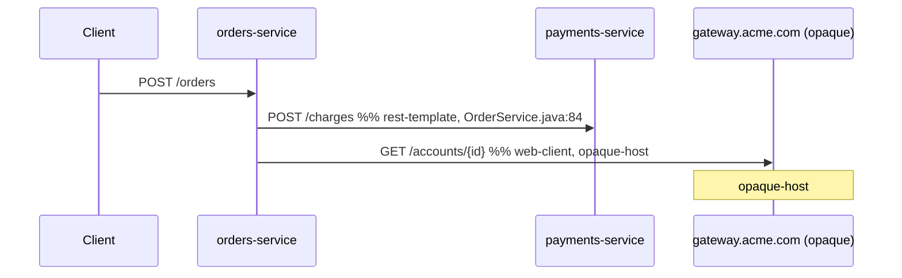

# Output Format

This reference defines the exact shape of the two artifacts the Agent emits when executing the `code-based-request-tracing` skill:

- `tracing-report.md` — the human-readable Markdown report (Mermaid diagrams + hop-by-hop evidence table).
- `tracing-graph.json` — the machine-readable graph (schema documented in `tracing-graph-schema.md`).

This file owns the report shape only. The JSON shape is owned by `tracing-graph-schema.md`; the rules for what counts as a marker (`opaque-host`, `unresolved`, `cycle-detected`, `max-depth-reached`, `match-ambiguous`) are owned by `target-resolution.md` and `trace-construction.md` and are merely **rendered** here.

## Output location

- The Agent writes both files into a single output directory whose path is supplied by the user.
- When the user does not supply a path, the Agent defaults to `./tracing-output/` relative to the current working directory.
- When the output directory does not exist, the Agent creates it before writing either file.
- When `tracing-report.md` or `tracing-graph.json` already exists in the output directory, the Agent overwrites the existing file with the new run's output.

### Idempotent overwrite semantics

- A rerun against the same inputs (same Service_Repo paths, same `host-mappings.yaml`, same skill version) produces byte-identical content for `tracing-graph.json` **except** for the `runTimestamp` field, and byte-identical content for `tracing-report.md` **except** for the `Run timestamp` line in the run-metadata block.
- Ordering is deterministic: services, endpoints, and calls are emitted in stable sort order (services by `name`, endpoints by `(serviceName, httpMethod, path)`, calls by `(callerServiceName, evidenceFile, evidenceLine)`). The Agent must not introduce nondeterministic ordering (e.g., from a hash-set traversal).
- The Agent never appends to existing files. Both `tracing-report.md` and `tracing-graph.json` are fully rewritten on each run.

## `tracing-report.md` top-level structure

The report is a single Markdown file with exactly four top-level sections, in this order:

1. **Run metadata** — provenance for the current run.
2. **Component diagram** — one Mermaid `flowchart` block covering every Service, every Opaque_Hop hostname, and every Kafka topic.
3. **Per-entry-point traces** — one subsection per Entry_Point, each containing one Mermaid `sequenceDiagram` block.
4. **Hop-by-hop evidence** — one table covering every detected Outbound_Call, with the fixed column order specified below.

Skeleton:

````markdown
# Cross-Service Tracing Report

## Run metadata
- Run timestamp: <ISO 8601 UTC>
- Output directory: <path>
- Repositories analyzed:
  - <path> → <service-name> (spring-boot)
  - <path> → <service-name> (non-spring-boot, skipped)
- Host mappings applied:
  - <hostPattern> → <service> (rule id <n>)
- Name conflicts:
  - <name>: <repoA>, <repoB>
- Skipped repositories:
  - <path>: <reason>

## Component diagram


## Per-entry-point traces

### <service-name> <HTTP-METHOD> <path>
Source: `<file>:<line>`

```mermaid
sequenceDiagram
  ...
```

(repeat per entry point)

## Hop-by-hop evidence

| Caller | Kind | Target (raw) | Target (resolved) | HTTP method / topic op | Evidence file:line | Status | Marker |
| ------ | ---- | ------------ | ----------------- | ---------------------- | ------------------ | ------ | ------ |
| ... |
````

### Run-metadata fields

The `## Run metadata` section is a flat bullet list. The Agent emits the following fields in this order; bullets with no entries are emitted as a heading bullet with `(none)` rather than omitted, so the section shape is stable across runs.

| Field | Format | Notes |
| --- | --- | --- |
| `Run timestamp` | ISO 8601 UTC (e.g., `2025-01-15T12:34:56Z`) | UTC only; `Z` suffix; second precision. |
| `Output directory` | Workspace-relative path or absolute path as supplied by the user | Defaults to `./tracing-output/` when not supplied. |
| `Repositories analyzed` | One sub-bullet per repo: `<path> → <service-name> (spring-boot)` or `<path> → <service-name> (non-spring-boot, skipped)` | Path is what the user supplied (absolute or workspace-relative); service name is post-conflict-disambiguation (i.e., includes `@<repoDirName>` when applicable). |
| `Host mappings applied` | One sub-bullet per matched mapping entry: `<hostPattern or urlPrefix> → <service> (rule id <n>)` | Only entries that matched at least one call are listed. If none matched, emit `(none)`. |
| `Name conflicts` | One sub-bullet per conflict group: `<name>: <repoA>, <repoB>[, ...]` | Lists the original (pre-disambiguation) name and the colliding repo directory names. If none, emit `(none)`. |
| `Skipped repositories` | One sub-bullet per skipped repo: `<path>: <reason>` where reason ∈ `not-found`, `not-readable`, `not-spring-boot` | If none, emit `(none)`. |

The same metadata is mirrored in `tracing-graph.json` (`runTimestamp`, `outputDir`, `services[]`, `hostMappings[]`, `nameConflicts[]`, `skippedRepositories[]`); see `tracing-graph-schema.md`. The report and the graph must agree on every metadata value within a single run.

## Component diagram template

One Mermaid `flowchart` block. Every Service, every Opaque_Hop hostname, and every Kafka topic is a node; every detected Outbound_Call is an edge. Three `classDef` styles distinguish opaque hosts, Kafka topics, and unresolved targets from regular Service nodes (regular services use the default node style).

````markdown
```mermaid
flowchart LR
  classDef opaque fill:#f7e6c4,stroke:#a07a2c
  classDef topic  fill:#e6f3ff,stroke:#3870b3
  classDef unresolved fill:#f4d4d4,stroke:#a82828,stroke-dasharray:4 2

  svc_orders["orders-service"]
  svc_payments["payments-service"]
  host_gw["gateway.acme.com<br/>(opaque)"]:::opaque
  topic_orders_events(["orders.events"]):::topic
  unresolved_1["${remote.config.url}<br/>(unresolved)"]:::unresolved

  svc_orders -->|POST /charges| svc_payments
  svc_orders -->|GET /accounts/{id}| host_gw
  svc_orders -->|publish| topic_orders_events
  svc_orders -.->|GET (unresolved)| unresolved_1
```
````

Node-id conventions (used for stable diffs across runs):

- Service: `svc_<service-name-with-non-id-chars-replaced-by-underscore>`.
- Opaque host: `host_<hostname-with-dots-replaced-by-underscore>`.
- Kafka topic: `topic_<topic-name-with-dots-replaced-by-underscore>`.
- Unresolved: `unresolved_<sequential-integer>` (sequence is per-run, ordered by call iteration order).

Edge labels: `<HTTP-METHOD> <path>` for HTTP kinds; `publish` or `consume` for Kafka kinds. `match-ambiguous` is **not** rendered in the component diagram (it is a per-trace concern); the component diagram shows the call once with the resolved target.

## Sequence diagram template (one per entry point)

One Mermaid `sequenceDiagram` block per Entry_Point, inside a `### <service-name> <HTTP-METHOD> <path>` subsection that also carries a `Source: \`<file>:<line>\`` line pointing at the controller method.

````markdown
### orders-service POST /orders
Source: `src/main/java/com/acme/orders/web/OrderController.java:42`


````

Edge annotation conventions:

- Solid arrow `->>` for resolved hops (status `resolved-service`, `opaque-host`, `kafka-topic`).
- Dashed arrow `-->>` for unresolved targets, with `(unresolved)` appended to the label.
- Trailing `%%` comment carries `<kind>, <evidenceFile-basename>:<line>` so the diagram is self-documenting; the full evidence path lives in the hop-by-hop evidence table.
- The synthetic `Client` participant is always emitted as the first participant for every sequence diagram so the entry-point arrow has a source.
- Participant aliases use the same node-id convention as the component diagram (`orders`, `payments`, `gw`, etc.) but rendered via `participant <alias> as <display-name>`.

## Marker rendering

Markers are emitted by the trace walker (see `trace-construction.md`) and the resolution stage (see `target-resolution.md`). This file specifies how each marker appears in the report.

| Marker | Component diagram | Sequence diagram | Evidence table |
| --- | --- | --- | --- |
| `opaque-host` | Target node uses `:::opaque` class; node label includes `<br/>(opaque)`. Edge label unchanged. | After the edge to the opaque node, emit `Note over <node>: opaque-host`. Edge label suffixed with `(opaque)`. | `Marker` column = `opaque-host`. `Status` column = `opaque-host`. |
| `unresolved` | Target rendered as a dedicated `unresolved_<n>` node with `:::unresolved` class; edge uses dashed `-.->`. | Edge uses dashed arrow `-->>`; label suffixed with `(unresolved)`; emit `Note over <last-participant>: unresolved`. | `Marker` column = `unresolved`. `Status` column = `unresolved`. `Target (resolved)` column = `null` (rendered as the literal `null`). |
| `cycle-detected` | Not rendered (the component diagram is a flat view; cycles are a per-trace concern). | At the point where the walker would re-enter a seen node, do not draw the re-entry arrow; instead emit `Note over <node>: cycle-detected`. | `Marker` column = `cycle-detected` on the edge that closes the cycle. |
| `max-depth-reached` | Not rendered. | At the last drawn node before truncation, emit `Note over <last-node>: max-depth-reached`. | `Marker` column = `max-depth-reached` on the final included call. |
| `match-ambiguous` | Not rendered (the component diagram shows the call once with the resolved target as recorded in `calls[]`). | List each candidate target as a separate edge from the same caller, each labeled with `(ambiguous)`; emit `Note over <caller>: match-ambiguous` once. | `Marker` column = `match-ambiguous` for each of the candidate rows; `Target (resolved)` carries the candidate service/endpoint. |

When a single hop carries more than one marker (e.g., `opaque-host` and `max-depth-reached` because the walker stopped at an opaque hop), both markers are listed in the `Marker` column joined by `, ` (comma-space), in the order: `match-ambiguous`, `cycle-detected`, `max-depth-reached`, `opaque-host`, `unresolved`. The diagram emits one `Note over` per marker.

## Evidence table

A single Markdown table at the end of the report. One row per detected Outbound_Call. Columns are emitted in this fixed order:

| # | Column | Source | Notes |
| - | ------ | ------ | ----- |
| 1 | `Caller` | `calls[].callerServiceName` | Service name post-conflict-disambiguation. |
| 2 | `Kind` | `calls[].kind` | One of `rest-template`, `web-client`, `feign-client`, `kafka-listener`, `kafka-template`. |
| 3 | `Target (raw)` | `calls[].targetRaw` | Verbatim source expression (e.g., `${payments.base-url}/charges`). Pipe characters in the raw text are escaped as `\|` so the table parses. |
| 4 | `Target (resolved)` | `calls[].targetResolved` | Concrete URL/host/topic, or the literal `null` when `status == unresolved`. |
| 5 | `HTTP method / topic op` | `calls[].httpMethod` for HTTP kinds; `publish` or `consume` for Kafka kinds | Empty cell never; for Kafka kinds emit `publish` (`kafka-template`) or `consume` (`kafka-listener`). |
| 6 | `Evidence file:line` | `calls[].evidenceFile` + `:` + `calls[].evidenceLine` | Forward-slash path; 1-based line number. |
| 7 | `Status` | `calls[].status` | One of `resolved-service`, `opaque-host`, `kafka-topic`, `unresolved`. |
| 8 | `Marker` | Marker(s) attached to this call (see preceding section) | Empty cell when no markers apply (typical for a clean `resolved-service` hop). |

Row ordering matches the deterministic call ordering used in `tracing-graph.json`: `(callerServiceName, evidenceFile, evidenceLine)` ascending. Reruns produce byte-identical row order.

## Cross-references

- `multi-repo-input.md` — service-name resolution and conflict disambiguation (drives the `Repositories analyzed` and `Name conflicts` bullets).
- `detection-patterns.md` — what counts as a `kind` and what fills `targetRaw` / `httpMethod`.
- `target-resolution.md` — how `targetResolved`, `status`, and the `opaque-host` / `unresolved` markers are assigned.
- `trace-construction.md` — how `cycle-detected`, `max-depth-reached`, and `match-ambiguous` markers are emitted.
- `tracing-graph-schema.md` — the canonical JSON shape that the report mirrors; every value rendered here is sourced from a field defined there.
