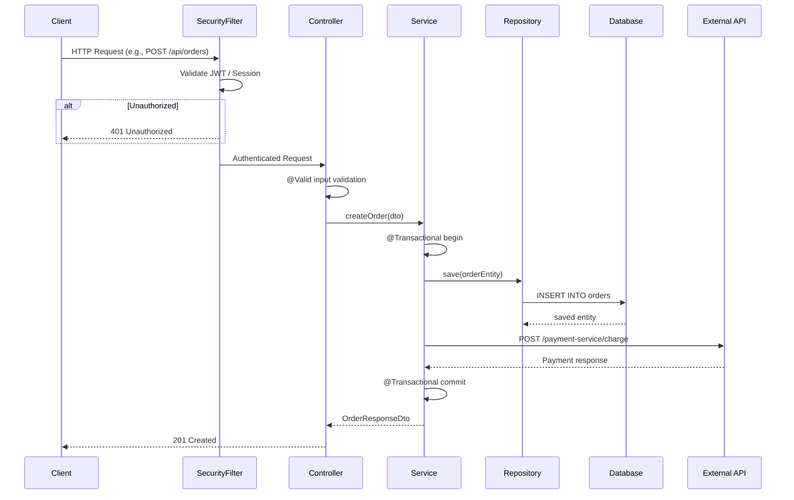
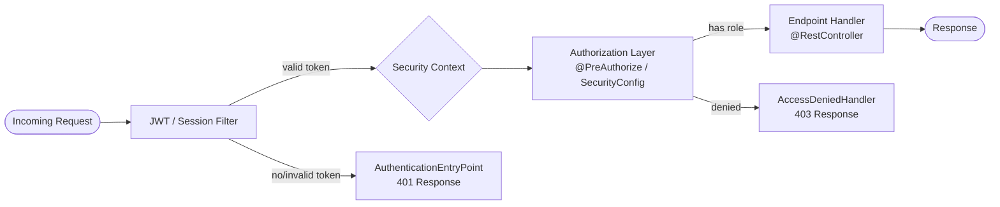

---
name: springboot-analyzer
version: 2
description: >
  Deep-analysis skill for Java Spring Boot codebases. Scans the entire repository to map
  end-to-end code flow, analyze dependencies, detect security vulnerabilities and critical
  flaws, generate component interaction diagrams (Mermaid), perform a full code review,
  and produce prioritized improvement recommendations. Invoke whenever the user asks to
  analyze, audit, review, or diagram a Spring Boot application.
agents: [main_agent, general_purpose]
***

# Spring Boot Codebase Analyzer

This skill performs a **full-spectrum analysis** of a Java Spring Boot application.
It covers architecture mapping, dependency auditing, security scanning, code review,
and actionable improvement recommendations. The output is a structured Markdown report
with embedded Mermaid diagrams.

No MCP servers are required. All file access is done via the tools already available
in the current environment (bash, fetch_url, search_web, read, execute_code).

***

## Activation Triggers

Load and execute this skill when the user asks for **any** of:

- Scanning / analyzing a Spring Boot or Java Maven/Gradle project
- Code review of a backend or microservice repo
- Dependency or vulnerability analysis
- Application map, component diagram, or flow diagram
- Architecture overview or end-to-end flow mapping
- Security audit of a Java application
- Identifying flaws, anti-patterns, or technical debt
- Suggesting improvements or refactoring opportunities

***

## Prerequisites

Before starting the analysis, confirm or resolve:

1. **Repository location** — one of:
   - A **GitHub URL** (e.g. `https://github.com/owner/repo`) — clone it with `git clone`
   - A **local path** already on disk — use it directly
   - **Files pasted** into the conversation — write them to a temp directory first
   - If none of the above is provided, ask: "Please share the GitHub URL or local path
     to your Spring Boot project."
2. **Branch** — default to `main` or `master`. If the user specifies a branch, check it
   out after cloning.
3. **Scope** — full repo (default) or a specific module. Ask only for mono-repos with
   many independent services.

Do NOT ask about Java version, cloud provider, or other optional details — infer them
from the code.

***

## How to Access the Code

### Option A — GitHub URL (most common)

```bash
# Clone the repo into a temp working directory
git clone --depth=1 https://github.com/owner/repo /tmp/springboot-analysis/repo

# If a specific branch is needed
git clone --depth=1 --branch feature-x https://github.com/owner/repo /tmp/springboot-analysis/repo
```

Use `bash` tool to run git commands. All subsequent file reads are then done from
`/tmp/springboot-analysis/repo/`.

### Option B — Local Path

The user has already provided the path (e.g. `/home/user/projects/my-service`).
Use that path directly in all bash commands below.

### Option C — Files Pasted in Chat

Write each file to a temp directory and treat it as a local path:

```bash
mkdir -p /tmp/springboot-analysis/repo
# write files using bash heredocs or execute_code
```

***

## Execution Plan

Execute the following phases **in order**. Each phase feeds the next.
Set a shell variable at the start for convenience:

```bash
REPO=/tmp/springboot-analysis/repo   # or the user-provided path
```

***

### Phase 0 — Repository Snapshot

**Goal:** Build a structural map of the project before reading any code.

```bash
# Top-level structure
find $REPO -maxdepth 3 -type f | sort | head -n 200

# Detect build tool
ls $REPO/pom.xml $REPO/build.gradle $REPO/build.gradle.kts 2>/dev/null

# Count Java source and test files
find $REPO/src/main/java -name "*.java" | wc -l
find $REPO/src/test/java -name "*.java" 2>/dev/null | wc -l

# List all packages
find $REPO/src/main/java -type d | sed "s|$REPO/src/main/java/||" | sort

# Docker/container artifacts
ls $REPO/Dockerfile $REPO/docker-compose.yml $REPO/.dockerignore 2>/dev/null

# CI/CD
ls $REPO/.github/workflows/ $REPO/.gitlab-ci.yml $REPO/Jenkinsfile 2>/dev/null
```

Record findings in a **Project Inventory** table.

***

### Phase 1 — Dependency & Build Analysis

**Goal:** Identify all declared dependencies, their versions, and risk areas.

```bash
# Maven
cat $REPO/pom.xml

# Gradle Groovy DSL
cat $REPO/build.gradle

# Gradle Kotlin DSL
cat $REPO/build.gradle.kts

# Multi-module: list all sub-module pom files
find $REPO -name "pom.xml" | sort
```

Extract and classify each dependency into:
- **Core Framework** (spring-boot-starter-*, spring-cloud-*)
- **Data / Persistence** (JPA, JDBC, Flyway, Liquibase, Redis, MongoDB, etc.)
- **Security** (spring-security-*, oauth2, jwt libraries)
- **Messaging** (Kafka, RabbitMQ, SQS, etc.)
- **Web / API** (spring-web, spring-webflux, OpenFeign, RestTemplate, WebClient)
- **Testing** (JUnit, Mockito, Testcontainers, WireMock)
- **Observability** (Actuator, Micrometer, Zipkin, OpenTelemetry)
- **Utilities** (Lombok, MapStruct, Guava, Apache Commons, etc.)

Flag:
- Spring Boot version below 3.x (legacy); below 2.7 (EOL)
- Deprecated dependencies (e.g. `spring-security-oauth2` legacy module)
- Missing standard deps for the apparent use case (no test starter, no actuator)
- Version conflicts (managed BOM vs. manually overridden versions)
- `SNAPSHOT` versions on a production-track branch

**Output:** Dependency Matrix table + Flags list.

***

### Phase 2 — Configuration & Properties Analysis

**Goal:** Understand app configuration and detect misconfigurations.

```bash
# All properties/yaml files
find $REPO/src/main/resources -name "application*.properties" -o -name "application*.yml" | sort
cat $REPO/src/main/resources/application.properties 2>/dev/null
cat $REPO/src/main/resources/application.yml 2>/dev/null
cat $REPO/src/main/resources/application-prod.yml 2>/dev/null
cat $REPO/src/main/resources/application-dev.yml 2>/dev/null
cat $REPO/src/main/resources/bootstrap.yml 2>/dev/null

# ConfigurationProperties classes
grep -rn "@ConfigurationProperties" $REPO/src/main/java/ --include="*.java" -l
grep -rn "@Value" $REPO/src/main/java/ --include="*.java" | grep -v ".test." | head -n 40
```

Check for:
1. Hardcoded secrets — passwords, API keys, JWT secrets, DB credentials in property files
   or `@Value("literal-value")` annotations — **CRITICAL** if found
2. Profile separation — prod config separate from dev? `spring.profiles.active` set?
3. Database config — HikariCP pool size/timeout, `ddl-auto=create-drop` in prod (**CRITICAL**)
4. Security settings — CORS wildcard, CSRF disabled, actuator endpoints without auth
5. Logging levels — `DEBUG` or `TRACE` in prod config leaks internal data
6. External service URLs — parameterized or hardcoded?
7. Missing prod-hardening — connection timeouts, retry policies, circuit breaker config

**Output:** Configuration Findings table with severity (CRITICAL / HIGH / MEDIUM / LOW / INFO).

***

### Phase 3 — Application Entry Point & Bootstrap Analysis

**Goal:** Trace how the application starts and what it registers.

```bash
# Find the main application class
grep -rn "@SpringBootApplication" $REPO/src/main/java/ --include="*.java" -l

# Read the main class
grep -rn "@SpringBootApplication" $REPO/src/main/java/ --include="*.java" -l | xargs cat

# Find all @Configuration classes
grep -rn "@Configuration" $REPO/src/main/java/ --include="*.java" -l

# CommandLineRunner / ApplicationRunner implementations
grep -rn "CommandLineRunner\|ApplicationRunner\|ApplicationListener" $REPO/src/main/java/ --include="*.java" -l

# Conditional beans
grep -rn "@ConditionalOn\|@Profile" $REPO/src/main/java/ --include="*.java" | head -n 30
```

Map the package structure to architecture layers:
- `controller` / `resource` / `rest` → Presentation
- `service` / `application` / `usecase` → Business/Application
- `repository` / `dao` / `persistence` → Data Access
- `domain` / `model` / `entity` → Domain Model
- `config` / `configuration` → Cross-cutting Config
- `security` → Security Configuration
- `dto` / `request` / `response` → Data Transfer Objects
- `mapper` / `converter` / `transformer` → Mapping
- `exception` / `error` / `advice` → Error Handling
- `client` / `feign` / `integration` → External Service Clients
- `event` / `messaging` / `kafka` → Async/Messaging
- `scheduler` / `job` / `task` → Scheduled Tasks
- `util` / `helper` / `common` → Utilities

**Output:** Package Map + Bootstrap flow narrative.

***

### Phase 4 — REST API & Controller Analysis

**Goal:** Map all exposed HTTP endpoints and assess their quality.

```bash
# All controllers
grep -rn "@RestController\|@Controller" $REPO/src/main/java/ --include="*.java" -l

# Read each controller file
grep -rn "@RestController\|@Controller" $REPO/src/main/java/ --include="*.java" -l | xargs cat

# Endpoint mappings
grep -rn "@GetMapping\|@PostMapping\|@PutMapping\|@DeleteMapping\|@PatchMapping\|@RequestMapping" \
  $REPO/src/main/java/ --include="*.java" | head -n 80

# Security annotations on endpoints
grep -rn "@PreAuthorize\|@Secured\|@RolesAllowed\|@PermitAll\|@DenyAll" \
  $REPO/src/main/java/ --include="*.java"

# Validation annotations
grep -rn "@Valid\|@Validated" $REPO/src/main/java/ --include="*.java"

# CrossOrigin usage
grep -rn "@CrossOrigin" $REPO/src/main/java/ --include="*.java"
```

Check for:
- `@RequestBody` without `@Valid` / `@Validated` — missing input validation
- Unprotected endpoints not in SecurityConfig permit-all list
- `@CrossOrigin("*")` — overly broad CORS
- Returning `@Entity` objects directly instead of DTOs
- Missing `@ResponseStatus` on non-GET operations
- Controllers with more than ~5 endpoint methods (missing service extraction)

Build the **API Endpoint Inventory** table.

***

### Phase 5 — Service Layer Analysis

**Goal:** Understand business logic, transaction boundaries, and inter-service calls.

```bash
# All service classes
grep -rn "@Service" $REPO/src/main/java/ --include="*.java" -l

# Read all service files
grep -rn "@Service" $REPO/src/main/java/ --include="*.java" -l | xargs cat

# Transactional usage
grep -rn "@Transactional" $REPO/src/main/java/ --include="*.java"

# Exception handling patterns
grep -rn "catch (Exception\|catch(Exception" $REPO/src/main/java/ --include="*.java"

# Self-invocation risk
grep -rn "@Async\|@Transactional" $REPO/src/main/java/ --include="*.java" -l | \
  xargs grep -l "this\."
```

Check for:
- Missing `@Transactional` on write operations
- `@Transactional` on `private` methods (no-op in Spring proxy model) — **MEDIUM**
- Missing `@Transactional(readOnly = true)` on read methods
- Self-invocation of `@Transactional` or `@Async` methods (proxy bypass) — **HIGH**
- Synchronous HTTP calls inside transactions (deadlock/timeout risk)
- God services with more than 20 methods
- Swallowed exceptions (`catch (Exception e) { }` with no rethrow or meaningful handling)
- Missing global `@ControllerAdvice` / `@ExceptionHandler`

***

### Phase 6 — Data Access Layer Analysis

**Goal:** Assess repository patterns, query safety, and database interaction quality.

```bash
# All repository interfaces and classes
grep -rn "@Repository\|JpaRepository\|CrudRepository\|PagingAndSortingRepository" \
  $REPO/src/main/java/ --include="*.java" -l

# Read all repository files
grep -rn "@Repository\|JpaRepository\|CrudRepository" \
  $REPO/src/main/java/ --include="*.java" -l | xargs cat

# All entity classes
grep -rn "^@Entity\|^  @Entity" $REPO/src/main/java/ --include="*.java" -l | xargs cat

# Native / custom queries
grep -rn "@Query" $REPO/src/main/java/ --include="*.java"

# Fetch type declarations
grep -rn "FetchType\|@OneToMany\|@ManyToMany\|@ManyToOne\|@OneToOne" \
  $REPO/src/main/java/ --include="*.java"

# Cascade declarations
grep -rn "CascadeType\|cascade" $REPO/src/main/java/ --include="*.java"

# Pagination usage
grep -rn "Pageable\|PageRequest\|findAll()" $REPO/src/main/java/ --include="*.java"
```

Check for:
- SQL injection in `@Query` with string concatenation — **CRITICAL**
- N+1 query problem: `@OneToMany` / `@ManyToMany` without `JOIN FETCH` or `@EntityGraph` — **HIGH**
- `findAll()` without `Pageable` on potentially large tables
- `CascadeType.ALL` on public-facing entities (accidental delete propagation)
- `@Entity` with `equals`/`hashCode` on mutable fields (Hibernate cache bugs)
- Missing `@Version` for optimistic locking on high-contention entities
- Bidirectional relationships without `mappedBy` (duplicate join tables)
- Missing `@Index` annotations on frequently queried foreign key or unique columns

***

### Phase 7 — Security Analysis

**Goal:** Identify authentication, authorization, and common vulnerability patterns.

```bash
# Security configuration
grep -rn "SecurityFilterChain\|WebSecurityConfigurerAdapter\|HttpSecurity" \
  $REPO/src/main/java/ --include="*.java" -l | xargs cat

# Password encoding
grep -rn "PasswordEncoder\|BCrypt\|MD5\|SHA-1\|sha1\|md5\|NoOpPasswordEncoder" \
  $REPO/src/main/java/ --include="*.java"

# JWT usage
grep -rn "jwt\|JWT\|JsonWebToken\|jjwt\|nimbus" \
  $REPO/src/main/java/ --include="*.java" -i | head -n 30

# CORS configuration
grep -rn "CorsConfiguration\|allowedOrigins\|addAllowedOrigin\|corsConfigurationSource" \
  $REPO/src/main/java/ --include="*.java"

# CSRF
grep -rn "csrf()" $REPO/src/main/java/ --include="*.java"

# Actuator exposure
grep -rn "management\." $REPO/src/main/resources/ -r 2>/dev/null

# Sensitive data in logs
grep -rn "log.*password\|log.*token\|log.*secret\|log.*key" \
  $REPO/src/main/java/ --include="*.java" -i | head -n 20

# File path operations with user input
grep -rn "new File\|Paths.get\|FileInputStream\|FileOutputStream" \
  $REPO/src/main/java/ --include="*.java" | head -n 20

# Open redirect patterns
grep -rn "redirect:" $REPO/src/main/java/ --include="*.java"
```

Assess:
- Authentication mechanism: form login, HTTP Basic, JWT, OAuth2, SAML
- Password encoding: BCrypt/Argon2 = good; plaintext/MD5/SHA-1 = **CRITICAL**
- Authorization: `permitAll()` vs `authenticated()` vs role-based rules
- CSRF: disabled on session-based apps = **HIGH**; acceptable for stateless JWT APIs
- CORS: `allowedOrigins("*")` with `allowCredentials(true)` = **CRITICAL**
- Security headers: `frameOptions`, `contentSecurityPolicy`, HSTS configured?
- JWT: `alg:none` acceptance, missing expiry validation, secret in plain properties
- Actuator: `/actuator/env`, `/actuator/heapdump`, `/actuator/shutdown` without auth = **CRITICAL**
- Mass assignment: `@RequestBody MyEntity` directly in controllers
- SpEL injection: user input flowing into `@PreAuthorize` expressions

***

### Phase 8 — Code Quality & Anti-Pattern Analysis

**Goal:** Identify structural flaws, anti-patterns, and technical debt.

```bash
# Field injection (anti-pattern)
grep -rn "@Autowired" $REPO/src/main/java/ --include="*.java" | grep -v "//"

# Manual ApplicationContext usage (service locator anti-pattern)
grep -rn "ApplicationContext\|getBean(" $REPO/src/main/java/ --include="*.java"

# Resource management
grep -rn "new RestTemplate()" $REPO/src/main/java/ --include="*.java"
grep -rn "InputStream\|Connection\|Session" $REPO/src/main/java/ --include="*.java" | \
  grep -v "try\|@" | head -n 20

# Lombok on entities
grep -rn "@Data" $REPO/src/main/java/ --include="*.java" -l | \
  xargs grep -l "@Entity" 2>/dev/null

# TODO/FIXME in production code
grep -rn "TODO\|FIXME\|HACK\|XXX" $REPO/src/main/java/ --include="*.java" | \
  grep -v "src/test" | head -n 30

# Large methods (rough indicator)
awk '/\{/{depth++} /\}/{depth--} depth>5{print FILENAME ":" NR}' \
  $(find $REPO/src/main/java -name "*.java") | head -n 20

# Async in same class (proxy bypass)
grep -rn "@Async" $REPO/src/main/java/ --include="*.java" -l | \
  xargs grep -n "this\." 2>/dev/null | head -n 20

# Concurrent state in singletons
grep -rn "private.*=.*new\|private static" $REPO/src/main/java/ --include="*.java" | \
  grep -v "final\|static final\|Logger" | head -n 30

# Test coverage estimate
MAIN=$(find $REPO/src/main/java -name "*.java" | wc -l)
TEST=$(find $REPO/src/test/java -name "*.java" 2>/dev/null | wc -l)
echo "Source files: $MAIN | Test files: $TEST | Ratio: $(echo "scale=1; $TEST*100/$MAIN" | bc)%"
```

Check for:
1. **Architecture violations** — controller calling repository directly, entities as DTOs
2. **Exception handling** — swallowed exceptions, returning `null` instead of `Optional`
3. **Concurrency** — mutable state in singleton beans, `@Async` proxy bypass
4. **Resource management** — streams/connections without try-with-resources
5. **Spring idioms** — field injection, manual `getBean()`, circular dependencies
6. **Testing gaps** — no test directory, thin coverage, no Testcontainers
7. **Lombok misuse** — `@Data` on `@Entity`, `@AllArgsConstructor` on entities
8. **Code smells** — TODO/FIXME in prod, magic numbers, deeply nested conditionals

***

### Phase 9 — Diagram Generation

**Goal:** Produce three Mermaid diagrams reflecting the actual codebase.

> **Important:** Use real class names and package names found in Phases 0–8.
> Never use the placeholder names shown in these templates.
> Add or remove nodes based on what actually exists in the repo.
> Use `subgraph` blocks for multi-module layouts.

#### Diagram 1 — Component Interaction Map

```mermaid
graph TD
    Client([HTTP Client / Browser]) --> |REST| Controller
    Controller[Controllers\n@RestController] --> |calls| Service
    Service[Services\n@Service] --> |reads/writes| Repository
    Service --> |calls| ExternalClient[External Clients\n@FeignClient / WebClient]
    Service --> |publishes| MessageBroker[(Message Broker\nKafka / RabbitMQ)]
    Repository[Repositories\n@Repository] --> |JDBC/JPA| Database[(Database\nPostgres / MySQL)]
    SecurityFilter[Spring Security\nFilterChain] --> |intercepts| Controller
    ConfigProps[@ConfigurationProperties] --> |injects| Service
    MessageBroker --> |consumes| Consumer[Message Consumers\n@KafkaListener]
    Consumer --> |calls| Service
    Scheduler[Scheduled Tasks\n@Scheduled] --> |calls| Service
```

#### Diagram 2 — End-to-End Request Flow

Use a **real endpoint** from the codebase as the example.



#### Diagram 3 — Security Architecture



***

### Phase 10 — Findings Summary & Improvement Roadmap

**Goal:** Consolidate all findings into a prioritized, actionable report.

#### Severity Classification

| Severity | Criteria | Example |
|----------|----------|---------|
| **CRITICAL** | Direct exploit, data loss, auth bypass | Hardcoded secret, actuator exposed without auth |
| **HIGH** | Significant security or data integrity risk | N+1 in hot path, proxy bypass on transactions |
| **MEDIUM** | Quality or operational risk, no direct exploit | Missing @Transactional, field injection |
| **LOW** | Code smell, maintainability concern | Magic strings, large class, missing Javadoc |
| **INFO** | Good patterns, neutral observations | Consistent DTO usage, proper error handling |

#### Full Report Structure (in order)

1. **Executive Summary** — 3–5 bullets: what the app does, tech stack, overall health verdict
2. **Project Inventory** — table: modules, packages, source file count, test file count, ratio
3. **Dependency Analysis** — table of all deps with version flags; flagged issues list
4. **Configuration Findings** — table: setting, current value, severity, recommended value
5. **API Endpoint Inventory** — table: method, path, auth required, validation present, notes
6. **Security Findings** — numbered list by severity; each entry: file path + line, description, impact, fix with before/after code
7. **Code Quality Findings** — same structure as Security Findings
8. **Architecture Observations** — narrative: pattern used (layered/hexagonal/CQRS), consistency, drift
9. **Component Interaction Map** (Diagram 1)
10. **End-to-End Request Flow** (Diagram 2)
11. **Security Architecture** (Diagram 3)
12. **Prioritized Improvement Roadmap**:

| Priority | Category | Issue | Effort | Impact |
|----------|----------|-------|--------|--------|
| P0 — Fix Now | Security | Example: hardcoded DB password | Low (30 min) | CRITICAL |
| P1 — This Sprint | Data | Example: N+1 queries in hot path | Medium (2h) | HIGH |
| P2 — Next Sprint | Testing | Example: add integration tests | High (1 day) | MEDIUM |
| P3 — Backlog | Quality | Example: split God service | High (2 days) | LOW |

***

## Additional Checks (Beyond the Basics)

### Observability & Operability

```bash
grep -rn "actuator\|Actuator\|HealthIndicator\|InfoContributor" \
  $REPO/src/main/java/ --include="*.java" | head -n 20
grep -rn "traceparent\|X-B3\|TraceId\|SpanId\|OpenTelemetry\|Zipkin" \
  $REPO/src/main/java/ --include="*.java" | head -n 10
grep -rn "logstash\|logback.*json\|JsonLayout\|StructuredLog" \
  $REPO/src -r 2>/dev/null | head -n 10
```

- Is `spring-boot-actuator` present and secured?
- Are distributed tracing headers propagated?
- Is structured/JSON logging configured for prod profiles?
- Are custom health indicators present for critical dependencies?
- Is `management.endpoints.web.exposure.include` explicitly restricted?

### Performance Profiling Hints

```bash
grep -rn "@Cacheable\|@CacheEvict\|@CachePut" $REPO/src/main/java/ --include="*.java"
grep -rn "@Async" $REPO/src/main/java/ --include="*.java"
grep -rn "Pageable\|Page<\|Slice<" $REPO/src/main/java/ --include="*.java" | head -n 20
grep -rn "WebClient\|RestTemplate" $REPO/src/main/java/ --include="*.java" -l | \
  xargs grep -n "timeout\|connectTimeout\|readTimeout" 2>/dev/null
```

- Large entities fetched in list endpoints without projections
- Expensive reads missing `@Cacheable`
- HTTP clients without timeout / connection pool config
- No async processing for I/O-heavy operations
- `@Scheduled` tasks that can overlap if long-running (missing `fixedDelay` or locking)

### Resilience & Fault Tolerance

```bash
grep -rn "Resilience4j\|resilience4j\|@CircuitBreaker\|@Retry\|@Bulkhead\|@RateLimiter\|spring-retry" \
  $REPO -r 2>/dev/null | head -n 20
```

- External HTTP calls without timeout = hanging threads
- No retry policy on transient failures
- No circuit breaker on downstream calls
- No fallback when external services are unavailable

### API Design Quality

```bash
# Non-RESTful verb-in-URL patterns
grep -rn "Mapping.*get\|Mapping.*create\|Mapping.*delete\|Mapping.*fetch\|Mapping.*update" \
  $REPO/src/main/java/ --include="*.java" -i | grep -v "GetMapping\|@"

# OpenAPI annotations
grep -rn "@Operation\|@ApiResponse\|@Schema\|@Tag" \
  $REPO/src/main/java/ --include="*.java" | wc -l

# API versioning
grep -rn '"/api/v[0-9]\|RequestMapping.*v[0-9]' \
  $REPO/src/main/java/ --include="*.java" | head -n 10
```

- Verbs in URLs (`/getUser`, `/createOrder`) — non-RESTful naming
- Missing API versioning strategy
- Inconsistent error response format across controllers
- Missing OpenAPI / Swagger annotations
- List endpoints without pagination

### Cloud-Native Readiness

```bash
grep -rn "spring.application.name" $REPO/src/main/resources/ -r 2>/dev/null
grep -rn "server.shutdown\|graceful" $REPO/src/main/resources/ -r 2>/dev/null
grep -rn "liveness\|readiness\|health/live\|health/ready" \
  $REPO/src/main/resources/ -r 2>/dev/null
cat $REPO/Dockerfile 2>/dev/null | grep -i "user\|USER"
ls $REPO/k8s/ $REPO/helm/ $REPO/deploy/ 2>/dev/null
```

- `spring.application.name` set (required for tracing and service discovery)
- Graceful shutdown configured (`server.shutdown=graceful`)
- Liveness and readiness probes via actuator
- Environment-specific configs externalized (not baked into the JAR)
- Docker image built with a non-root user

### Test Quality

```bash
find $REPO/src/test -name "*.java" | head -n 50
grep -rn "@SpringBootTest" $REPO/src/test/ --include="*.java" | wc -l
grep -rn "Testcontainers\|@Testcontainers\|@Container" $REPO/src/test/ --include="*.java" | wc -l
grep -rn "WireMock\|@WireMockTest\|WireMockServer" $REPO/src/test/ --include="*.java" | wc -l
grep -rn "@MockBean\|@Mock\|Mockito" $REPO/src/test/ --include="*.java" | wc -l
```

- `@SpringBootTest` used for every test (slow) vs. targeted slice tests
- Testcontainers for database integration tests
- WireMock for external HTTP call stubbing
- Test-to-source ratio (aim for > 50% file count ratio as a minimum signal)
- Service layer coverage above 70%

### Build & Dependency Hygiene

```bash
grep -n "dependency-check\|owasp\|versions-maven\|dependencyUpdates" $REPO/pom.xml 2>/dev/null
grep -n "wrapper\|mvnw\|gradlew" $REPO/ -r --include="*.properties" 2>/dev/null | head -n 5
ls $REPO/mvnw $REPO/gradlew 2>/dev/null
grep -n "SNAPSHOT" $REPO/pom.xml 2>/dev/null | grep -v "<!--"
```

- OWASP Dependency-Check plugin present in build config
- Dependency versions managed via BOM (not ad-hoc overrides)
- Maven or Gradle wrapper present for reproducible builds
- No `SNAPSHOT` dependencies on a production-track branch

***

## Output Format

Write the final report to the sandbox:

```bash
# Use the actual repo name in the filename
REPORT=/tmp/springboot-analysis/springboot-analysis-$(basename $REPO).md
```

The report must contain:
- All tables from the report sections above
- All three Mermaid diagrams as fenced code blocks (` ```mermaid ` ... ` ``` `)
- Severity badges in bold: **[CRITICAL]**, **[HIGH]**, **[MEDIUM]**, **[LOW]**
- Before/after code snippets for every CRITICAL and HIGH finding
- The full Improvement Roadmap table as the final section

After writing, call `share_files` with the report path to deliver it.

In the **chat response**, provide:
- A 3–5 sentence executive summary
- The top 3 most critical findings (one line each)
- Confirmation that the full report has been shared

***

## Behavior Rules

1. **Never skip a phase** — if a section is empty, write "Not applicable — no [X] found."
2. **Never fabricate findings** — every finding must cite a specific file path and line
   number from actual bash output.
3. **Always show fix examples** — for every CRITICAL or HIGH finding, show before/after code.
4. **Diagrams must reflect reality** — replace all placeholder names with real class/package
   names from the codebase.
5. **Be opinionated** — give a clear severity call with a one-sentence justification.
   Do not hedge.
6. **Read exhaustively** — if `find` returns many files, read them all. Do not stop at
   the first few results.
7. **Cross-check findings** — a finding in Phase 7 may be mitigated by something in
   Phase 4. Re-evaluate before finalizing severity.
8. **Cite file paths precisely** — format: `src/main/java/com/example/UserService.java:42`

***

## Example Invocation

User says:
> "Can you analyze my Spring Boot repo at https://github.com/acme/payments-service?"

Steps:
1. Run `git clone --depth=1 https://github.com/acme/payments-service /tmp/springboot-analysis/repo`
2. Set `REPO=/tmp/springboot-analysis/repo`
3. Execute Phases 0–10 using bash commands above
4. Write report to `/tmp/springboot-analysis/springboot-analysis-payments-service.md`
5. Call `share_files` with the report path
6. Respond in chat with executive summary + top 3 findings
